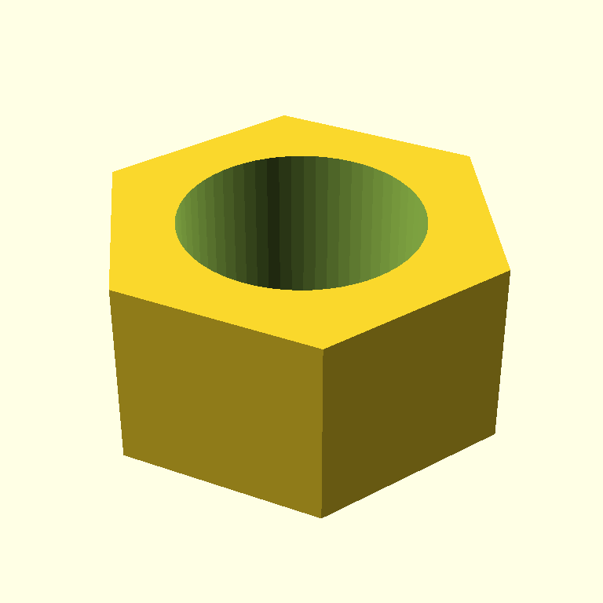

# scadia

> Drive OpenSCAD with Claude. Natural language in, 3D models out — built as a **bounded design loop** with vision feedback.

[](https://github.com/jmcpheron/pycon2026/actions/workflows/ci.yml)
[](https://github.com/jmcpheron/pycon2026/actions/workflows/build-stl.yml)
[](https://jmcpheron.github.io/pycon2026/)
[](LICENSE)
[](https://www.python.org/)

<p align="center">
  
  <br/>
  <em>An M10 hex nut. Generated end-to-end from the prompt <code>"a hexagonal nut, M10"</code>.</em>
</p>

---

> **PyCon 2026 demo** — Built to share at PyCon US 2026 in Long Beach (May 14–17). [Live demo page →](https://jmcpheron.github.io/pycon2026/)

[](https://codespaces.new/jmcpheron/pycon2026)

## Quickstart

```bash
git clone https://github.com/jmcpheron/pycon2026
cd pycon2026
uv sync
cp .env.example .env  # then add your ANTHROPIC_API_KEY
uv run scadia "a hexagonal nut, M10" --iterations 3
```

Every iteration's `.scad`, `.png`, validation report, and the critique land in `output/run-<timestamp>/` along with a `manifest.json` that records the loop's stop reason.

## How it works

```
                    ┌─────────────────┐
   user prompt ────►│  generate SCAD  │  Anthropic, text-in/text-out
                    └────────┬────────┘
                             │
                             ▼
                    ┌─────────────────┐
                    │     OpenSCAD    │
                    │  (subprocess)   │
                    └────────┬────────┘
                       PNG    │   stderr
                  ┌───────────┴────────────┐
                  ▼                        ▼
          ┌──────────────┐         ┌────────────────┐
          │ vision critic │         │  validator     │
          │ (sensor)     │         │  (sensor)      │
          │ blocking /   │         │  manifold,     │
          │ nonblocking, │         │  geometry,     │
          │ next action  │         │  warnings      │
          └──────┬───────┘         └────────┬───────┘
                 │                          │
                 └──────────┬───────────────┘
                            ▼
                    ┌──────────────┐
                    │  controller  │   should_continue:
                    │   (agent.py) │   is another iteration
                    └──────┬───────┘   likely to improve the model?
                           │
                  ┌────────┴────────┐
                  │                 │
              refine SCAD       final STL
              (loop back)        (done)
```

The critic does not decide when we are done. The controller decides whether another iteration is worth spending. The critic is one input.

## Showcase models

The [`models/`](models/) directory holds checked-in OpenSCAD source files. On every push, the [`build-stl`](.github/workflows/build-stl.yml) workflow compiles them to STL files and commits them back — so you can grab a printable `.stl` straight from the repo without running anything locally.

## Running in Codespaces

Click the **Open in GitHub Codespaces** button above. The container comes with Python 3.12, OpenSCAD, and `xvfb` pre-installed. Inside the Codespace:

```bash
# Add your key as a Codespaces secret named ANTHROPIC_API_KEY
# (Settings → Codespaces → secrets), then:
xvfb-run uv run scadia "a small mug" --iterations 3
```

The `xvfb-run` prefix gives OpenSCAD an OpenGL context for PNG rendering. STL-only commands don't need it.

## Requirements (local)

- Python 3.11+
- [OpenSCAD](https://openscad.org/) on your `$PATH`
- An Anthropic API key
- [`uv`](https://docs.astral.sh/uv/) (recommended)

## Status

v1: bounded design loop with two sensors. Phase 2: 3D-printable challenge coin with a QR code linking to the OpenSCAD source on the coin itself — a self-describing artifact, designed to hand out at PyCon 2026.

## License

MIT
