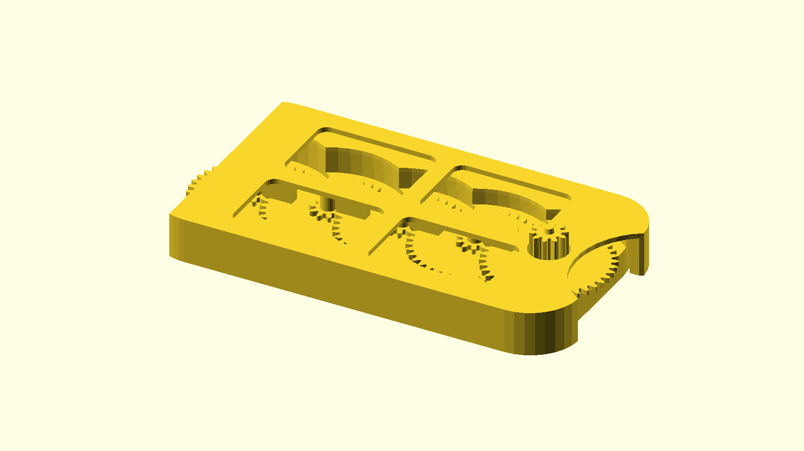
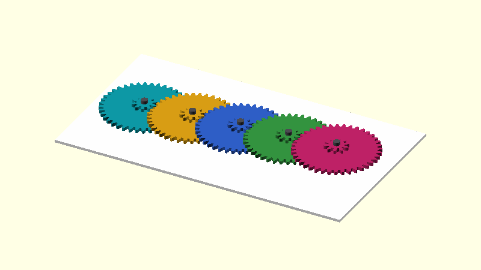
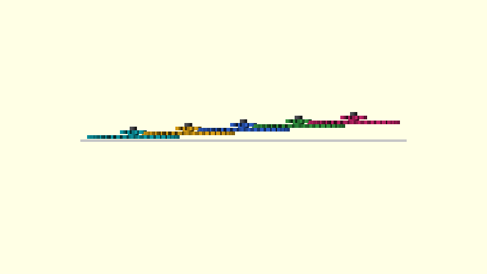
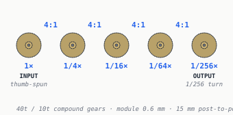
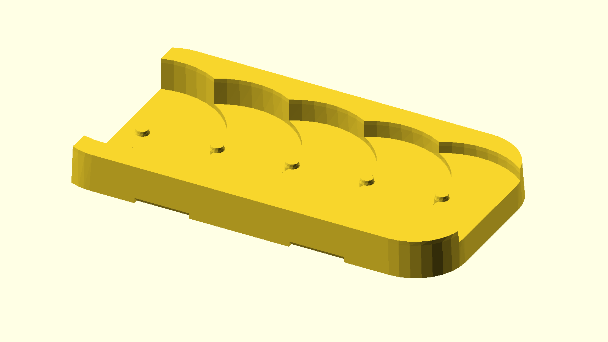
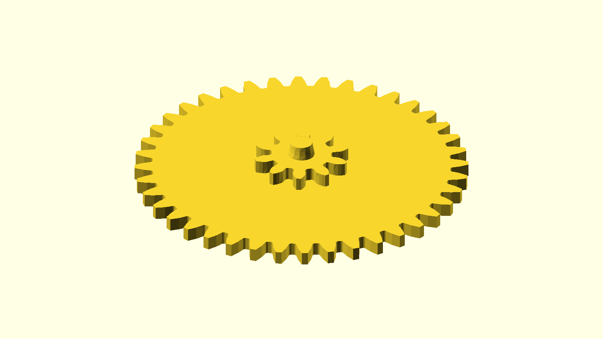

# pycon2026 — a 256:1 reduction-gear card

> A credit-card-sized object with a five-gear compound reduction chain — 256:1 from input to output. Designed in Onshape, deconstructed by Python.

[](https://github.com/jmcpheron/pycon2026/actions/workflows/ci.yml)
[](https://github.com/jmcpheron/pycon2026/actions/workflows/build-card.yml)
[](https://github.com/jmcpheron/pycon2026/actions/workflows/build-explainers.yml)
[](https://jmcpheron.github.io/pycon2026/)
[](LICENSE)
[](LICENSE-3D-FILES)

<p align="center">
  
</p>

<p align="center">
  <sub>Onshape AP242 STEP → <a href="src/cardlab"><code>cardlab explode</code></a> → seven parts → animated GIF. The GIF rebuilds itself in CI whenever the STEP changes.</sub>
</p>

<p align="center">
  
</p>

<p align="center">
  <sub>Same five-gear chain, now <em>running</em>. Three-quarter iso view.</sub>
</p>

<p align="center">
  
</p>

<p align="center">
  <sub>Edge view reveals the staircase: each compound gear stacks one gear-thickness higher in Z so the print stays thin. Both GIFs are built parametrically from <a href="src/explainers/card.py"><code>card.py</code></a> with <a href="https://github.com/gumyr/build123d"><code>build123d</code></a> + <a href="https://github.com/gumyr/bd_warehouse"><code>bd_warehouse.gear.SpurGear</code></a>; rendered frame-by-frame by OpenSCAD and stitched by Pillow. Rebuilt by <a href="src/cardlab/spin.py"><code>cardlab spin</code></a>. (Both libraries Apache-2.0 — see <a href="ACKNOWLEDGMENTS.md">ACKNOWLEDGMENTS</a>.)</sub>
</p>

<p align="center">
  
</p>

<p align="center">
  <sub>And here's the actual print. Two card halves, five blue compound gears, the input pinion poking out the right edge for your thumb — print-in-place from the same <a href="jmcpheron-card.step"><code>jmcpheron-card.step</code></a> the GIFs above are generated from.</sub>
</p>

<p align="center">
  
</p>

<p align="center">
  <sub>Each mesh is a 4:1 reduction. Five gears, four meshes, 4<sup>4</sup> = <strong>256:1</strong>. See <a href="docs/explainers/gear-ratios.md">gear-ratios</a> for the math and thumb-travel intuition. Rebuilt by <a href="src/explainers/ratios.py"><code>explainers build ratios</code></a>.</sub>
</p>

<table>
<tr>
<td align="center" valign="top" width="33%">

<br/>
<sub><strong>Card half</strong><br/>78 × 44 mm body, five pockets, axle hole, bottle-opener notch.</sub>
</td>
<td align="center" valign="top" width="33%">

<br/>
<sub><strong>Standard compound gear</strong><br/>40-tooth driven disc + 10-tooth pinion on a short hub.</sub>
</td>
<td align="center" valign="top" width="33%">

<br/>
<sub><strong>Tall-hub variant</strong><br/>Same 40 / 10 teeth, taller hub. Interleaved with short-hub gears so the discs don't collide.</sub>
</td>
</tr>
</table>

> *Curious about the pattern behind this repo? See [SHAREABLE-CAD.md](SHAREABLE-CAD.md) for the synthesis — Onshape as source of truth, GitHub as the workshop, MakerWorld + Printables as the storefronts, and the [Adam Savage vault](docs/vault/) as the current worked example.*

## Lightning talk · PyCon US 2026

<p align="center">
  
</p>

<p align="center">
  <sub>View from the lightning-talk stage at PyCon US 2026 in Long Beach, Saturday evening, May 16, 2026.</sub>
</p>

I gave a five-minute lightning talk at PyCon US 2026, *["I Made a Gearbox Business Card, Then Made Python Explain It"](https://us.pycon.org/2026/schedule/presentation/175/)* — the story behind this repo, condensed to slides and a 3D-printed prop audience members could hold. The same lightning-talk session included Simon Willison's *"The last six months in LLMs in five minutes,"* with the latest update to his [pelican-riding-a-bicycle](https://simonwillison.net/tags/pelican-riding-a-bicycle/) LLM benchmark — a real honour to share a stage with.

A recording should land on the [PyCon US YouTube channel](https://www.youtube.com/@PyConUS) in the weeks after the conference; I'll embed the clip here when it's posted.

## How it works

Five compound gears in a chain. Four 4:1 meshes between them, multiplied together: **256:1**. Spin the input gear with your thumb; the output gear moves a quarter-degree.

*(Five gears, four reductions — an idler chain of the same gears would still only reduce 4:1.)*

There are six short explainer pages if you want the longer version:

- [**The card in 3D**](docs/explainers/card-3d.md) — the STEP file and the little script that pulls it apart. Start here.
- [**Gear ratios**](docs/explainers/gear-ratios.md) — compound multiplication, with a thumb-travel intuition: ~20.3 m of finger motion per output rotation.
- [**Decoding the gears from STEP**](docs/explainers/decoding-gears.md) — slice the committed STL, FFT the radial profile, recover the tooth count and module from geometry alone.
- [**Stacking**](docs/explainers/stacking.md) — why a 3-level cycle of hub heights keeps the card thin without the discs colliding.
- [**Terminology**](docs/explainers/terminology.md) — pinion, module, pitch circle, addendum. The 90 seconds of vocabulary the other pages assume.
- [**Printing considerations**](docs/explainers/printing.md) — orientation, chamfers, why each post is its own part.

## A second design — Pounce-a-Pult, a spiral-spring cat toy

To show the same pipeline works on more than just the gear card, here's another of my designs run through it: the [Pounce-a-Pult spiral cat toy](docs/pounce-a-pult/README.md). The parametric source lives in a [public Onshape document](https://cad.onshape.com/documents/01739d2a63dc91eaf28c2c62/w/a7c671d651186a5272cc789f/e/fdb2542c5ccec8040d59912a) (fork it to remix the geometry) with a [printable MakerWorld bundle](https://makerworld.com/en/models/2138778-pounce-a-pult-spiral-cat-toy#profileId-2316710) (slicer profile + photos). The STEP export sits at [`step-demo/pounce-a-pult.step`](step-demo/pounce-a-pult.step); `cardlab inspect` reads its AP242 tree, `cardlab render` produces orthographic hero PNGs, and `cardlab explode` decomposes it into six per-part STL/GLB/PNG renders plus an animated exploded GIF — the same five-function chain the gear card uses, no toy-specific code. Per-page write-up at [**docs/pounce-a-pult/**](docs/pounce-a-pult/README.md).

## How it gets built

The card itself lives in Onshape. The STEP export is committed at the repo root. A little Click CLI called `cardlab` (in [`src/cardlab/`](src/cardlab/)) does five small things to it, leaning on [`build123d`](https://github.com/gumyr/build123d) and [`cascadio`](https://github.com/trimesh/cascadio):

| Command | Does |
|---|---|
| `cardlab inspect` | AP242 schema, assembly tree, bounding box, tessellation stats; merges sidecar `.meta.toml` if present |
| `cardlab build` | Tessellates STEP → STL or **colored GLB** (cascadio path preserves Onshape's per-part colors) |
| `cardlab render` | Orthographic PNG via the OpenSCAD pipeline (iso/top/edge/front/right presets) |
| `cardlab explode` | Pulls an assembly apart into per-part STL/GLB/PNG + an exploded GLB + an animated GIF + a manifest |
| `cardlab assemble` | Glues multiple STEP parts into one assembly from a TOML manifest |
| `cardlab spin` | Renders the chain *running* — parametric gears via `bd_warehouse`, frame-by-frame OpenSCAD, PIL-stitched into `spin-iso.gif` + `spin-side.gif`. Reads only from `src/explainers/card.py`; the STEP file is not used. |

```
jmcpheron-card.step       ──►  cardlab inspect  ──►  docs/assets/card/inspect.txt
                          ──►  cardlab build    ──►  jmcpheron-card.{stl,glb}
                          ──►  cardlab explode  ──►  parts/*.{stl,glb,png}
                                                     exploded.{glb,gif}
                                                     manifest.toml
src/explainers/card.py    ──►  cardlab spin     ──►  spin-iso.gif
                                                     spin-side.gif
```

Everything in [`docs/assets/card/`](docs/assets/card/) is regenerated by [`.github/workflows/build-card.yml`](.github/workflows/build-card.yml) on any push that touches the STEP or the `cardlab` script, then auto-committed back. Push a new Onshape export and the hero GIF above updates itself within a minute.

The six explainer pages above are also Python — small scripts under [`src/explainers/`](src/explainers/) that emit the markdown and SVG diagrams. All the numbers come from one [`card.py`](src/explainers/card.py); change a number there and every page reflects it on the next build.

```
src/explainers/<topic>.py  ──►  uv run explainers build  ──►  docs/explainers/<topic>.md
```

## Try it yourself

```bash
git clone https://github.com/jmcpheron/pycon2026
cd pycon2026
uv sync --extra step
uv run cardlab inspect jmcpheron-card.step
uv run cardlab explode --in jmcpheron-card.step --out /tmp/card/
# → /tmp/card/{exploded.gif, jmcpheron-card.glb, parts/*.{stl,glb,png}, manifest.toml}
```

The `step` extra is opt-in — the OpenCascade wheel is ~180 MB.

Requirements: Python 3.11+, [OpenSCAD](https://openscad.org/) on your `$PATH`, [`uv`](https://docs.astral.sh/uv/). Or just [open the Onshape doc](https://cad.onshape.com/documents/786fefdef357fb6860b54650/w/33fb9222a6752311e4f08c8b/e/da99fedbaeebf1422d4cb0d3) and spin it in your browser — no install required.

## Things I'd love to chat about at PyCon

If you scanned this from the card I handed you, here's what I'm hoping to talk about. Find me on the floor — or open an issue.

- **3D printing**, especially print-in-place mechanisms and the geometry tricks that make them survive a bed-slinger.
- **Python ↔ CAD pipelines.** Onshape STEP exports → `cascadio` → `trimesh` → OpenSCAD → animated GIF, all in CI. I'd like to hear what other people are gluing together.
- **Open-source licensing for physical 3D files.** I went with CC BY-SA 4.0 for the geometry — did I get that right? STEP and STL aren't software; copyright on mechanical designs is fuzzy; CERN OHL exists. Would love to hear from people who've thought harder about this.
- **Defensive disclosure vs. license clauses** as protection against patent trolls and copyright-shaped opportunism. Public Onshape + dated commits is probably doing most of the work; share-alike does the rest. Or does it?
- **Devlog-as-build-journal** as a way to ship hardware in public. I'd like to hear from others doing the same.

## License

**Code** (`src/`, `tests/`, workflows): **MIT** — see [`LICENSE`](LICENSE).

**3D files** ([`jmcpheron-card.step`](jmcpheron-card.step), the generated STL / GLB / PNG / GIF under `docs/assets/card/` and `docs/vault/assets/`, and the [public Onshape document](https://cad.onshape.com/documents/786fefdef357fb6860b54650/w/33fb9222a6752311e4f08c8b/e/da99fedbaeebf1422d4cb0d3)): **CC BY-SA 4.0** — see [`LICENSE-3D-FILES`](LICENSE-3D-FILES).

Print it, fork it, remix the gears. If you publish a derivative — a different layout, a coin-sized version, whatever — it needs to be CC BY-SA 4.0 too, and please credit `pycon2026` by jmcpheron with a link back here.

## Acknowledgments

This project is a thin glue layer on top of a lot of other open-source
work — `build123d`, `bd_warehouse`, `cadquery-ocp` (OCCT), `cascadio`,
`trimesh`, `Pillow`, `drawsvg`, `matplotlib`, `click`, plus OpenSCAD
and `uv` outside Python. See [`ACKNOWLEDGMENTS.md`](ACKNOWLEDGMENTS.md)
for the full list with licenses and links.
