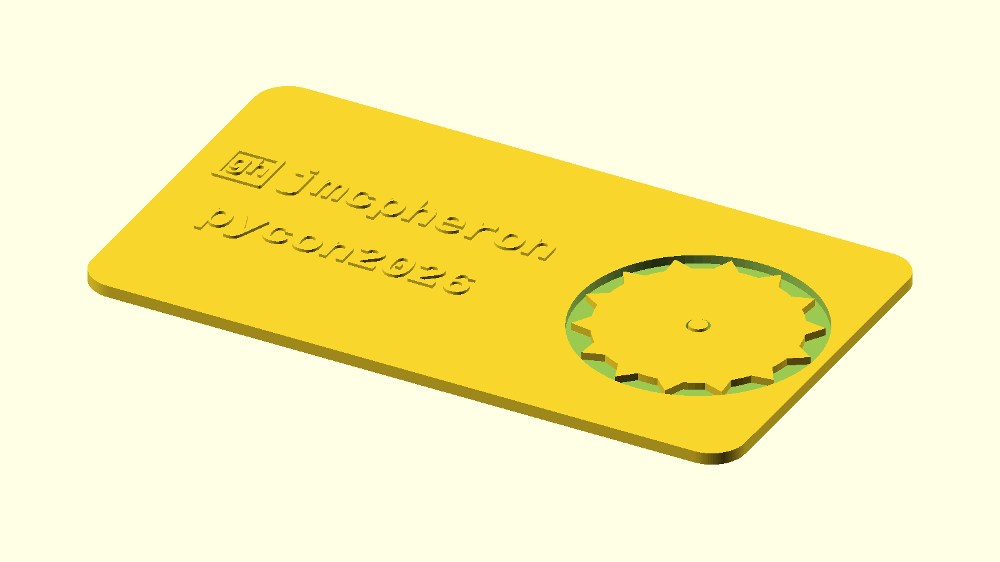
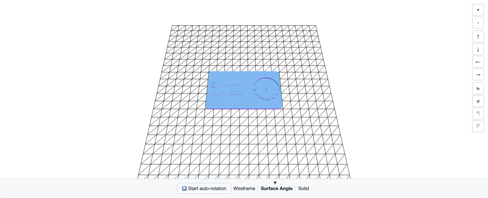
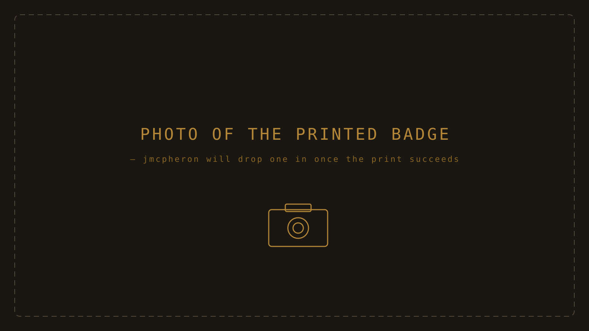

# pycon2026 — Python-driven hardware for PyCon US 2026

> Two parametric cards for the conference: a 3D-printable badge with a print-in-place spinning gear, and a credit-card-sized object housing a 256:1 compound reduction-gear chain. Every visual in this README was generated by a Python program that ran when someone pushed a commit.

[](https://github.com/jmcpheron/pycon2026/actions/workflows/ci.yml)
[](https://github.com/jmcpheron/pycon2026/actions/workflows/build-stl.yml)
[](https://github.com/jmcpheron/pycon2026/actions/workflows/build-card.yml)
[](https://jmcpheron.github.io/pycon2026/)
[](LICENSE)
[](https://www.python.org/)

<p align="center">
  
  <br/>
  <sub><strong>The reduction-gear card, exploded by Python.</strong> Onshape exports an AP242 STEP → <a href="src/stepforge"><code>stepforge explode</code></a> decomposes it into seven parts, renders each one with OpenSCAD, and stitches this animation frame by frame.</sub>
</p>

---

> **PyCon US 2026 — Long Beach, May 14–17.** Built to hand out and to fork. [Live demo page →](https://jmcpheron.github.io/pycon2026/)

## What's in this repo

Two physical artifacts and four Python tools that build them. The artifacts are the point; the tools are the show.

| Artifact | Status | Built by |
|---|---|---|
| **[The conference badge](#the-conference-badge)** | Shipping | [`badgeforge`](src/badgeforge) → OpenSCAD |
| **[The reduction-gear card](#the-reduction-gear-card)** | In progress | Onshape → [`stepforge`](src/stepforge) → OpenCascade |

Plus [`explainers`](src/explainers) for engineering writeups, and `scadia` (the legacy AI-loop tool — see the bottom of this README).

---

## The reduction-gear card

A credit-card-sized object with a five-stage compound reduction-gear chain (4:1 per stage → 256:1 total). The geometry is designed in Onshape; the *story* is told by Python.

The STEP file at the root of this repo ([`jmcpheron-card.step`](jmcpheron-card.step), 3.1 MB) is the canonical source. `stepforge` turns it into everything else.

<table>
<tr>
<td align="center" valign="top" width="33%">

<br/>
<sub><strong>Card half</strong><br/>78 × 44 mm body, four pockets for the gear train, axle hole, bottle-opener notch.</sub>
</td>
<td align="center" valign="top" width="33%">

<br/>
<sub><strong>Standard compound gear</strong><br/>40-tooth driven disc + 10-tooth pinion on a short hub.</sub>
</td>
<td align="center" valign="top" width="33%">

<br/>
<sub><strong>Tall-hub variant</strong><br/>Same 40 / 10 teeth but a taller hub. Two of these are interleaved with three short-hub gears to keep the discs from colliding.</sub>
</td>
</tr>
</table>

### How the visuals get made

```
jmcpheron-card.step  ──►  stepforge inspect  ──►  docs/assets/card/inspect.txt
                     ──►  stepforge build    ──►  jmcpheron-card.{stl,glb}  (cascadio preserves colors)
                     ──►  stepforge explode  ──►  parts/*.{stl,glb,png}
                                                  exploded.{glb,gif}
                                                  manifest.toml
```

Every artifact in `docs/assets/card/` is regenerated by [`.github/workflows/build-card.yml`](.github/workflows/build-card.yml) on any push that touches the STEP or stepforge sources, then auto-committed back. If you push a new export from Onshape, the README's hero GIF updates itself within a minute.

→ Full walkthrough: [**docs/explainers/card-3d.md**](docs/explainers/card-3d.md)
→ Engineering writeups: [gear ratios](docs/explainers/gear-ratios.md) · [stacking](docs/explainers/stacking.md) · [terminology](docs/explainers/terminology.md) · [printing](docs/explainers/printing.md)

---

## The conference badge

A 3D-printable PyCon 2026 badge with a print-in-place spinning gear. Parametric — change the name and GitHub handle, get a personalized STL out the other end.

<table>
<tr>
<td align="center" valign="top" width="33%">

<br/>
<sub><strong>1 · Source → OpenSCAD render</strong><br/>Python templates the SCAD, OpenSCAD renders the PNG. <a href=".github/workflows/build-stl.yml">Re-rendered in CI</a> on every push.</sub>
</td>
<td align="center" valign="top" width="33%">
<a href="https://github.com/jmcpheron/pycon2026/blob/main/models/card.stl"></a>
<br/>
<sub><strong>2 · Same source → STL on GitHub</strong><br/>The same Python pipeline produces <a href="https://github.com/jmcpheron/pycon2026/blob/main/models/card.stl"><code>models/card.stl</code></a> — <a href="https://github.com/jmcpheron/pycon2026/blob/main/models/card.stl">click to spin it in GitHub's viewer →</a></sub>
</td>
<td align="center" valign="top" width="33%">

<br/>
<sub><strong>3 · Same source → printed object</strong><br/>Coming soon — slice <code>card.stl</code>, print at 0.2 mm layers, pop the gear free with a fingernail.</sub>
</td>
</tr>
</table>

### What's on the badge

- **Body:** 88.9 × 50.8 × 1.6 mm — the standard business-card footprint, sized to fit a wallet sleeve.
- **Print-in-place gear:** a 30 mm spur gear sitting in a recessed pocket on a 2.4 mm post. The 0.2 mm sacrificial layer separates the gear from the post during printing; pop it free after.
- **Embossed text:** two-line `<name>` / `<github>` layout, 0.4 mm relief, Liberation Mono Bold. Defaults are `jmcpheron` and `pycon2026`. Both lines fit comfortably at ~9 characters each — longer strings will overflow into the gear pocket. (See [`docs/devlog/2026-05-06-card-text-mockups.html`](docs/devlog/2026-05-06-card-text-mockups.html) for the layout exploration.)

### Print settings (starting point)

| Setting | Value |
| --- | --- |
| Material | PLA |
| Layer height | 0.2 mm |
| Walls | 3 |
| Top/bottom layers | 4 |
| Infill | 20 % gyroid |
| Supports | none |
| Adhesion | brim 5 mm if your bed is uneven |

If the gear fuses to the post on first print, bump `gear_z_lift` from 0.2 to 0.3 mm in `models/card.scad`.

---

## Quickstart

```bash
git clone https://github.com/jmcpheron/pycon2026
cd pycon2026
uv sync
```

**Build a personalized badge:**

```bash
uv run badgeforge build --name "Your Name" --github "yourhandle"
# → models/card.stl
```

**Explore the gear card** (needs the heavier `step` extra — OpenCascade is ~180 MB):

```bash
uv sync --extra step
uv run stepforge inspect jmcpheron-card.step
uv run stepforge explode --in jmcpheron-card.step --out /tmp/card/
# → /tmp/card/{exploded.gif, jmcpheron-card.glb, parts/*.{stl,glb,png}, manifest.toml}
```

**Generate the explainer pages:**

```bash
uv sync --extra explainers
uv run explainers build
```

---

## The Python tools

### `badgeforge` — parametric SCAD generation

Small Click CLI on top of OpenSCAD. Templates the SCAD source from user inputs, runs `openscad` to render PNG and STL, returns the paths. Same code path runs locally and in CI; every push regenerates `models/card.stl` and the hero PNG.

```
  user values ──►  badgeforge CLI  ──►  openscad -D name=…  ──►  card.stl
  (--name,         (Python)             -D github=…             (binary STL)
   --github)                            card.scad
```

### `stepforge` — Python-driven STEP files

Click CLI on top of [`build123d`](https://github.com/gumyr/build123d) (OpenCascade) and [`cascadio`](https://github.com/trimesh/cascadio). Four subcommands:

| Command | Does |
|---|---|
| `stepforge inspect` | AP242 schema, assembly tree, bounding box, tessellation stats; merges sidecar `.meta.toml` if present |
| `stepforge build` | Tessellates STEP → STL or **colored GLB** (cascadio path preserves Onshape's per-part colors) |
| `stepforge render` | Orthographic PNG via the OpenSCAD pipeline (iso/top/edge/front/right presets) |
| `stepforge explode` | Decomposes an assembly into per-part STL/GLB/PNG + an exploded GLB + an animated GIF + a manifest |
| `stepforge assemble` | Composes multiple STEP parts into one assembly from a TOML manifest |

```
jmcpheron-card.step  ──►  inspect / build / render / explode  ──►  docs/assets/card/**
step-demo/parts/*    ──►  assemble                            ──►  step-demo/parts/assembled.step
```

The `step` extra is opt-in — the OpenCascade wheel is ~180 MB and most badge work doesn't need it.

### `explainers` — illustrated engineering writeups

Short, deterministic Python programs that produce the writeups under [`docs/explainers/`](docs/explainers/). The math, diagrams, and tables come from one canonical [`card.py`](src/explainers/card.py) — change a number there, every page reflects it on the next build.

```
src/explainers/<topic>.py  →  uv run explainers build  →  docs/explainers/<topic>.md (+ assets/*.svg)
```

Five sections, all auto-rebuilt in CI:

- [Gear ratios →](docs/explainers/gear-ratios.md) compound multiplication, thumb-travel.
- [Stacking →](docs/explainers/stacking.md) why a 3-level cycle keeps the card thin.
- [Terminology →](docs/explainers/terminology.md) pinion / hub / post / pitch circle, glossary.
- [3D-printing considerations →](docs/explainers/printing.md) orientation, chamfers, separate posts.
- [The card in 3D →](docs/explainers/card-3d.md) interactive `<model-viewer>` embed, exploded view, parts.

---

## Devlog

This is a working-out-loud project. Build progress, prints that worked, prints that didn't, and the design choices behind them live at [`docs/devlog/`](docs/devlog/).

## Requirements (local)

- Python 3.11+
- [OpenSCAD](https://openscad.org/) on your `$PATH`
- [`uv`](https://docs.astral.sh/uv/) (recommended)

## License

MIT

---

<details>
<summary><strong>Earlier: the AI design loop (scadia)</strong></summary>

Before the pivot to the badge, this repo was `scadia` — a Python tool that drove OpenSCAD code generation through Claude with a vision-feedback iteration loop. The loop and its experiments are still in this repo (`src/scadia/`, `scripts/multi_*.py`) and the showcase models in `models/` (m10-nut, scadvil, pi5-wall-mount, pi5-retro-case) are all outputs from it.

Why we stepped away from it for PyCon: the AI-loop arc had a Phase 3 plan (the Raspberry Pi case progression) that wasn't going to finish in time for the conference, and the badge was already half-built from Phase 2. The pivot is described in [`docs/devlog/2026-05-08-pivot-to-badge.html`](docs/devlog/2026-05-08-pivot-to-badge.html).

```
                    ┌─────────────────┐
   user prompt ────►│  generate SCAD  │
                    └────────┬────────┘
                             ▼
                    ┌─────────────────┐
                    │     OpenSCAD    │
                    └────────┬────────┘
                       PNG    │   stderr
                  ┌───────────┴────────────┐
                  ▼                        ▼
          ┌──────────────┐         ┌────────────────┐
          │ vision critic │         │  validator     │
          └──────┬───────┘         └────────┬───────┘
                 │                          │
                 └──────────┬───────────────┘
                            ▼
                    ┌──────────────┐
                    │  controller  │  should_continue?
                    └──────────────┘
```

To run the loop:

```bash
cp .env.example .env  # add ANTHROPIC_API_KEY
uv run scadia "a hexagonal nut, M10" --iterations 3
```

Output lands in `output/run-<timestamp>/`. The loop is still functional; it's just not the headline anymore.

</details>
