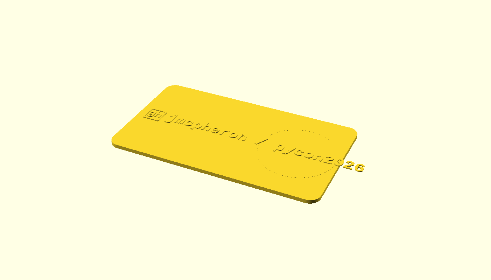
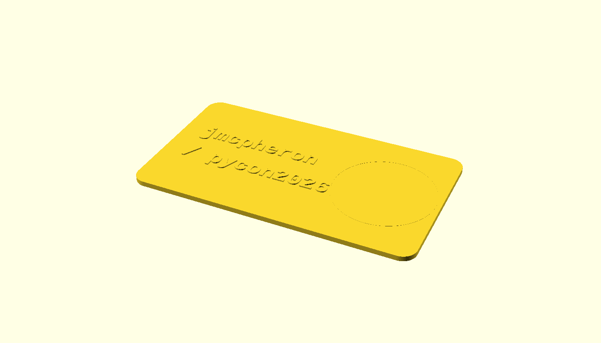

# Card-text layout mockups

*2026-05-06 · jmcpheron*

Six variants of the embossed face, all rendered from [`models/card-mockup.scad`](../../models/card-mockup.scad) at 0.4 mm relief on the same 88.9 × 50.8 × 1.6 mm card body. The faint dotted circle on the right is the gear pocket — that real estate is reserved for the print-in-place gear, so the text has to live to the left of it.

The `[gh]` outlined-square is a placeholder for the real GitHub mark; that's swapped in once a layout is chosen.

---

### Variant 1 — single line, slash separator

`[gh] jmcpheron / pycon2026`

**Notes:** Text runs across the gear pocket and past the right edge of the card. **Doesn't fit** — single-line is too long at any size that's still legible. Useful as a confirmation that the card needs two lines.

---

### Variant 2 — two lines, no slash

`[gh] jmcpheron` over `pycon2026`

**Notes:** Comfortably fits the available real estate. The mark sits inline with the username, which keeps the visual weight on the top line. Reads as "this person, this conference" — clear and clean.

---

### Variant 3 — slash as line prefix (file-pathy)

`jmcpheron` over `/ pycon2026`

**Notes:** The leading `/` gives it a URL/filesystem vibe. Bumps up against the gear pocket on the second line — barely fits. Drops the `[gh]` mark to make room.

---

### Variant 4 — corner mark + left-aligned stack

`[gh]` in top-left corner, then `jmcpheron` and `pycon2026` stacked

**Notes:** Mark is decoupled from the text — it becomes a corner accent rather than a prefix. The stack reads cleanly. Most "designed" of the variants, also the one with the most empty card area to play with later.

---

### Variant 5 — corner mark + right-aligned stack

Same content as v4, text right-aligned against the gear

**Notes:** Pulls the text toward the gear, creating a "label + mechanism" reading. Tight on the gear-side margin — feels crowded.

---

### Variant 6 — full repo path, single line

`github.com/jmcpheron/pycon2026`

**Notes:** Maximally explicit — anyone can type it back into a browser. Overflows the card at the size shown; would need a substantially smaller font (~3 mm) to fit, which sacrifices legibility from arm's length.

---

## Decision

<!-- TODO(jmcpheron): pick a variant (or describe a hybrid) and note why.
     This block becomes the canonical "what's on the card" reference. Once
     decided, update `text_layout()` in models/card.scad to match. -->

## Open follow-ups

- Drop the real GitHub mark SVG into `models/github-mark.svg` and swap the `[gh]` placeholder in the chosen variant.
- Confirm font availability on the build runner (CI uses Codespaces; Liberation Mono should ship by default but worth verifying after the first push).
- Test the chosen layout at the actual print size — embossing can drop legibility at scale that looks fine in a render.
