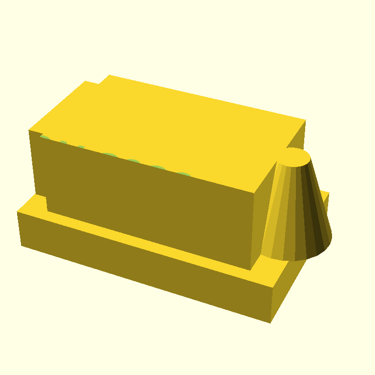
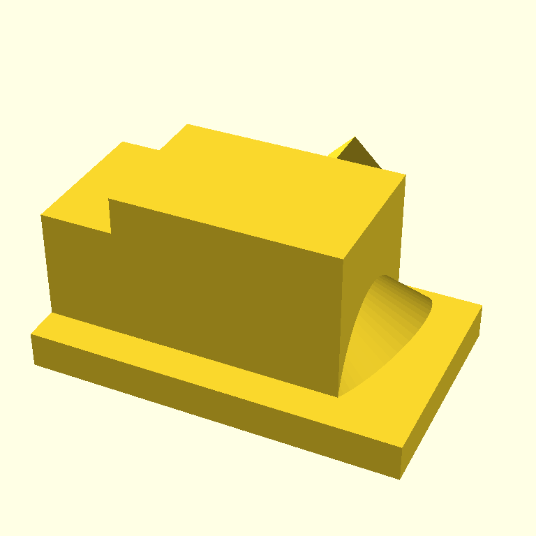

# Multi-model SCAD generation: simplified anvil across four models

*2026-05-07 · jmcpheron*

<!-- TODO(jmcpheron): voice intro. Suggested beats: scadia uses Claude Haiku as
     both generator and critic. The retro case revealed text-on-vertical-wall is
     a class of bug Claude tends to make (text lays flat instead of standing
     up on the wall). This experiment swaps in different generation models on
     the simplest possible anvil prompt — the same artifact, four different
     authors, no orientation hint. The question: is "letters lay flat" a Claude
     habit, or a universal LLM habit? -->

## The prompt

Same simplified anvil prompt sent to every model in this experiment. **Deliberately no orientation hint** — we want to see which models naturally know to `rotate` before `linear_extrude` for vertical-wall text:

```text
Create a small 3D-printable OpenSCAD anvil with "PYCON 2026" embossed on the side.

Build:
- A flat base
- A central body block on top of the base
- A tapered horn extending from one side
- A short heel block on the other side
- "PYCON 2026" text embossed (recessed) into one side face of the body

Constraints:
- Only cube(), cylinder(), text(), linear_extrude(), translate(), rotate(), difference(), union()
- $fn = 24 globally
- No minkowski() or hull()

Target ~50 mm wide. FDM-printable at 0.2 mm layers, no supports.
```

Generated by `scripts/multi_generator.py`, single-shot, same `SYSTEM_GENERATE` system prompt the live agent uses. Each model lands in its own commit on the `raspberry-pi-demos` branch.

## anthropic/claude-haiku-4.5 — baseline

The model scadia uses internally. Generated in 3.8s, rendered in 2.9s.



**What's right:**

- Recognizable anvil silhouette
- Actual tapered horn — uses `cylinder(h=16, r1=8, r2=3)`, a clean trick for a smooth cone-like taper without `hull()`
- 18 lines of SCAD; named modules; no over-engineering

**What's wrong (the bug we expected):**

- The PYCON 2026 text is the same horizontal-slab bug as in the retro case. The relevant block:

  ```scad
  module text_emboss() {
      translate([-15, -15, 20]) {
          linear_extrude(height = 1.5) {
              text("PYCON 2026", size = 6, halign = "center", valign = "center", font = "Arial:style=Bold");
          }
      }
  }
  ```

  The body's top face sits at z=20. The text is `linear_extrude`d from z=20 to z=21.5 — a flat slab *on top of* the body, with the letter shapes laid out in the XY plane. The `difference()` against the anvil only carves where the slab and body overlap, which is a paper-thin crust at z=20. Result: a barely-visible CSG seam on the top edge (the green dots in the render), nothing on a side wall.

  No `rotate()` was used. This is the third consecutive Claude run where wall-face text becomes a horizontal slab. Strong evidence it's a Claude habit, not a one-off.

**Next:** `google/gemini-2.5-flash` on the same prompt — different model, same task, see what changes.

## google/gemini-2.5-flash

Generated in 2.9s, rendered in 4.1s.



**What's right:**

- **Used `rotate([90, 0, 90])` before `linear_extrude`** — exactly the move Claude didn't make. Gemini knows that text on a vertical wall needs to be reoriented out of the XY plane first:

  ```scad
  module anvil_text() {
      translate([40, -0.1, 15]) {
          rotate([90, 0, 90]) {
              linear_extrude(height = 2) {
                  text("PYCON 2026", size = 8, font = "Sans:style=Bold");
              }
          }
      }
  }
  ```

  This is the first time across this branch's runs that a generator has reached for `rotate` on text. Strong evidence that "letters lay flat" is a Claude habit, not a universal LLM habit.

**What's wrong (different bug, same outcome):**

- The text emboss never reaches the rendered surface. The top-level structure is:

  ```scad
  union() {
      anvil_base();
      anvil_body();
      anvil_horn();
      anvil_heel();
      difference() {
          anvil_body();
          anvil_text();
      }
  }
  ```

  Notice `anvil_body()` is unioned **twice** — once positively, once with the text differenced. Since `union(A, A - text) = A`, the unmodified copy of the body covers the cut-out copy. The `difference()` runs but its result gets erased by the parallel union. **The text emboss is structurally invisible.** Gemini understood text orientation but missed that `difference()` needs to be at the top level, not buried alongside a duplicate of the same module.

- Horn is a 45°-rotated cylinder + cube combo — visible but reads as a tilted wedge rather than a clean tapered horn.
- Used `$fn = 60`, not the requested `$fn = 24` (minor).

**Cumulative pattern after two models:**

| model | rotate before extrude? | top-level difference? | text visible? |
|---|---|---|---|
| `claude-haiku-4.5` | no | yes (`difference(anvil(), text_emboss())`) | no — text laid flat above the body |
| `gemini-2.5-flash` | **yes** | no — text differenced against duplicate body | no — duplicate body overshadows the cut |

Both produced invisible text via different mistakes. Two models, two distinct bug classes — but if you only looked at renders you'd think they had the same problem.

**Next:** `openai/gpt-5-mini`.

<!-- (Subsequent model sections will append below as they ship.) -->
