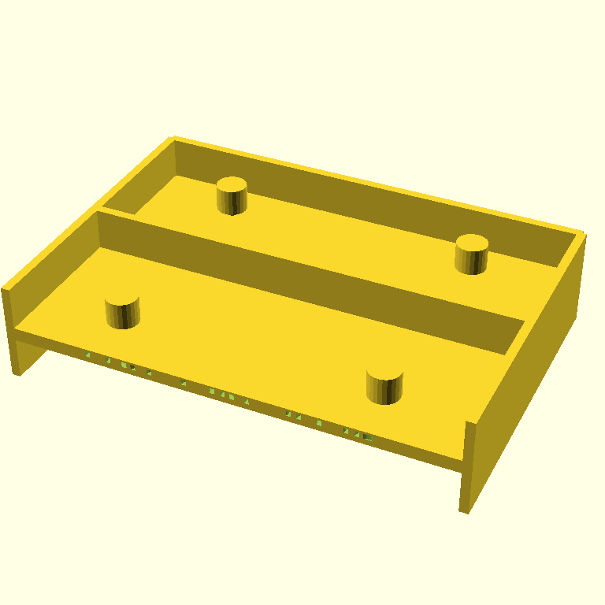
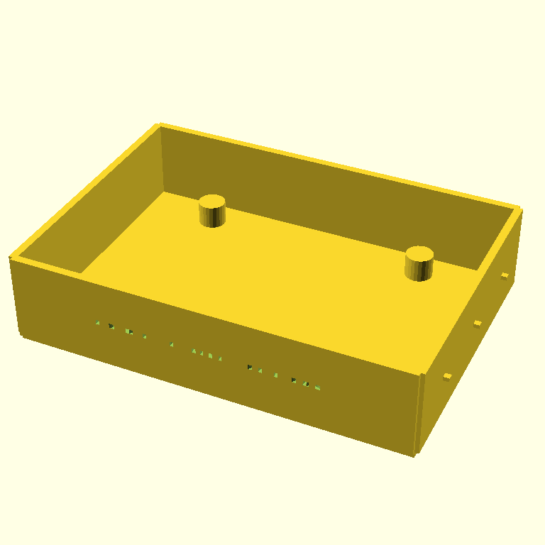

# Retro Pi 5 case — same blindspot, second confirmation

*2026-05-07 · jmcpheron*

<!-- TODO(jmcpheron): one or two sentences in your voice on what this stage is and
     where it sits in the arc. Suggested beats: this is the demo's most ambitious
     artifact (dimensional fidelity AND aesthetic intent in the same SCAD file);
     the agent converged in two iterations and the critic was happy; the SCAD has
     three bugs the critic couldn't see. The same blindspot we saw on the SCADvil. -->

## 07:44 — converged in two iterations, critic gave 9/10

The retro case is the demo arc's "preserve constraints while adding aesthetic intent" stage: same Pi 5 dimensions as the wall mount, plus 1980s-microcomputer styling (walls, decorative ribs, embossed `PYCON 2026`). I was prepared for another no-convergence run like the wall mount. Instead the agent **converged in two iterations** with the critic calling it done at 9/10.

The critic was wrong.

**Prompt:**

```text
Create a retro-styled tray enclosure for a Raspberry Pi 5 in OpenSCAD — the bottom half of a 1980s-style microcomputer case. Same Pi 5 dimensional fidelity as before, plus aesthetic intent.

Required Pi 5 dimensions (use these exactly):
- Board outline: 85 mm × 56 mm
- Mounting hole pattern: rectangular, 58 mm × 49 mm centers
- Mounting holes: 2.7 mm clearance (M2.5)

Build:
- A 100 × 70 mm rectangular tray with a 3 mm flat base
- Four walls around the perimeter, 22 mm tall and 2 mm thick (open top)
- Four 6 mm standoffs at the Pi 5 mounting-hole positions, with 2.7 mm M2.5 clearance holes drilled all the way through using a top-level difference()
- Three horizontal decorative ribs running along each LONG outer wall — small raised lines, 1 mm tall × 1.5 mm deep cross-section, evenly spaced vertically
- Embossed text 'PYCON 2026' recessed 0.6 mm into the front (short) outer wall, centered. The text must intersect the wall material — do not float.

Design constraints:
- Only cube(), cylinder(), text(), linear_extrude(), translate(), rotate(), difference(), union()
- Do NOT use minkowski() or hull()
- $fn = 24 globally
- ALL holes and the text emboss must be subtractive at the top level
- Sharp corners are fine

Prioritize getting the walls and standoffs right first, then the ribs, then the text. FDM-printable at 0.2 mm layers, base side down, no supports.
```

**The trajectory:**

| iter | render | score | done | summary |
|---|---|---|---|---|
| 0 |  | 6 | False | Walls disjointed — duplicate `cube()` calls produced overlapping segments instead of one continuous perimeter. Ribs not visible. Text not visible. Critic flagged the wall geometry, the missing ribs, and the missing text. |
| 1 |  | 9 | True | Walls clean and continuous. Standoffs in place. Critic summary: *"all meeting the design constraints with no blocking issues."* **This is the iteration we shipped.** |

Source: [`models/pi5-retro-case.scad`](../../models/pi5-retro-case.scad) — iter-1's SCAD verbatim.

## What the critic missed

Three bugs in the iter-1 SCAD source that don't show in the render:

### 1. The PYCON 2026 text is a horizontal slab, not wall-face text

```scad
module embossed_text() {
    translate([0, -36.2, 11])
        linear_extrude(height = 1.2, center = true) {
            text("PYCON 2026", size = 7, halign = "center", valign = "center");
        }
}
```

`text()` produces a 2D shape in the X-Y plane. `linear_extrude` pushes that 2D shape upward in Z. So the resulting solid is "letter-shaped in X-Y, 1.2 mm thick in Z" — a horizontal slab of letters lying flat, parallel to the floor. To put text on a vertical front wall, the agent needed to rotate 90° around X *before* extruding (or rotate the extruded result before translating). It didn't.

Because the slab is positioned at z = 11 (mid-wall height) with a 1.2 mm thickness, it intersects the front wall as a thin horizontal cut shaped like the letters' silhouettes. You see a barely-perceptible row of green CSG seams on the wall in the render, not "PYCON 2026."

### 2. The M2.5 holes don't reach the top of the standoffs

```scad
module standoff()      { cylinder(h = 6, r = 3.5); }     // z=3 to z=9 (after translate +3)
module standoff_holes() {
    cylinder(h = 7, r = 1.35);                            // z=-0.5 to z=6.5 (after translate -0.5)
    // …four of them at the corners
}
```

The standoff occupies z=3 to z=9 (height 6, lifted by 3 to sit on the base). The clearance hole occupies z=-0.5 to z=6.5 (height 7, dropped by 0.5 to bite into the base). They overlap from z=3 to z=6.5 — only the bottom 3.5 mm of each standoff is drilled.

**The top 2.5 mm of every standoff is solid material.** A Pi sitting on these standoffs would hit a wall when you try to thread an M2.5 screw down from the top. The render doesn't show this — the dark hole at the top of each standoff in iter-1 is just shading.

### 3. The decorative ribs are dots, not lines

```scad
module decorative_ribs() {
    for (i = [0 : 2]) {
        offset = -21 + i * 21;
        translate([-51.75, offset, 11]) cube([1.5, 1.5, 1], center = true);
    }
    // …same on the right wall
}
```

The prompt asked for "horizontal raised lines running along each long outer wall." The agent placed three 1.5 × 1.5 × 1 mm cubes per wall, evenly spaced *along* the wall length, **all at the same z height**. So instead of three horizontal lines stacked vertically (the 1980s-microcomputer aesthetic the prompt was reaching for), it's three dots in a horizontal row per wall. Functionally invisible in the render and aesthetically nothing.

## What this confirms about the loop

Two stages now (SCADvil iter-0 and retro case iter-1) where the critic returned `done=True` with high score, and the SCAD source had multiple CSG bugs visible only in code, not pixels. The Pi 5 wall mount was different — the critic correctly returned `done=False` across all three iterations there.

The pattern lining up:

| stage | critic verdict | source-level bugs | what made the difference |
|---|---|---|---|
| SCADvil iter-0 | done=True / 8 | 3 (peg-not-hole, floating text, faux taper) | shape was small/familiar; vision saw "anvil silhouette" and approved |
| Pi 5 wall mount | done=False / 4–5 across 3 iter | bugs caught and partially fixed each round | sharper dimensional prompt → sharper critic |
| retro case iter-1 | done=True / 9 | 3 (text orientation, hole depth, rib geometry) | bigger, more aesthetic shape; vision saw "retro tray" and approved |

When the prompt is dimensional and constrained ("85 × 56 board, 58 × 49 holes, M2.5 clearance"), the critic seems to evaluate against those concrete requirements and catches gaps. When the prompt has aesthetic words ("retro," "decorative," "embossed"), the critic seems to grade vibes and stop early.

<!-- TODO(jmcpheron): your read on what to take away from this. Some angles worth considering:

     - The critic isn't a generally-bad judge — it's good at dimensional checks and bad
       at aesthetic interpretation. Different sensors for different tasks.
     - This argues again for the AST-aware sensor option from the multi-critic post: a
       check that "all geometry intended as subtractive is actually inside a difference()"
       AND "linear_extrude(text(...)) on a vertical face requires a rotate" AND "hole
       cylinders extend at least to the top of the geometry they pass through" — three
       deterministic checks that catch all three bugs in this file. Not LLM-flavored.
     - For the talk, the slide is now: three artifacts, three sensor outcomes. SCADvil
       and retro case both fooled vision; Pi mount didn't. The shape of the request
       changed what the critic could verify.
     - Or: the convergence-in-two-iterations is itself suspicious. The Pi mount took
       three iterations and never converged. The retro case has more features and
       converged faster — because the critic stopped grading them.
   -->

## What's next

1. Print all three: SCADvil, Pi mount, retro case. The retro case will print but with the bugs called out above (unusable standoff holes, illegible text, no ribs). Photos will be appended to each post.
2. Decide whether to add a third sensor before stopping Phase 3. The AST-aware sensor would catch all three of this stage's bugs deterministically.
3. README TODO markers (pitch + Why-Pi framing) — your voice.

## 07:50 — printed object

<!-- TODO(jmcpheron): photo of the printed retro case + 1–2 lines on what survived
     and what didn't. The 'PYCON 2026' text won't be readable; the screws won't
     thread to the top of the standoffs; the ribs will be invisible. That's three
     concrete failure modes you can name in the talk. Append as a new ## HH:MM
     section here when the print is done. -->
