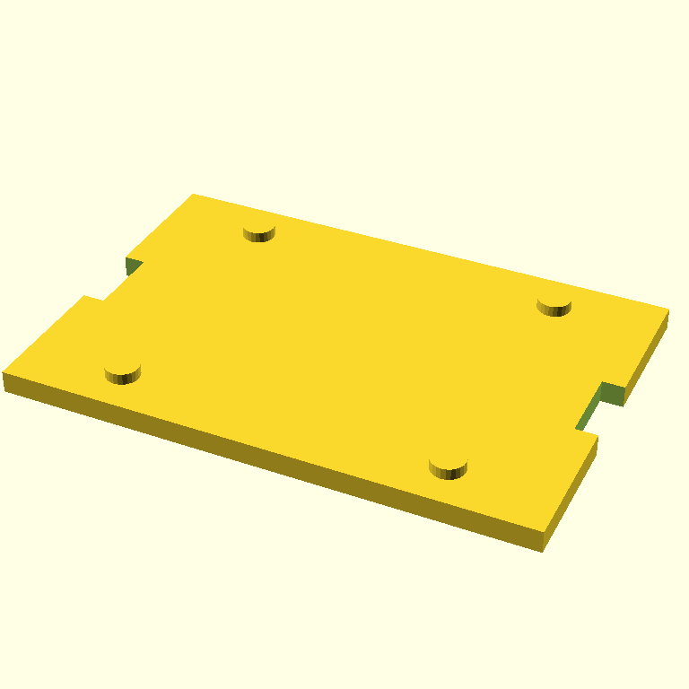
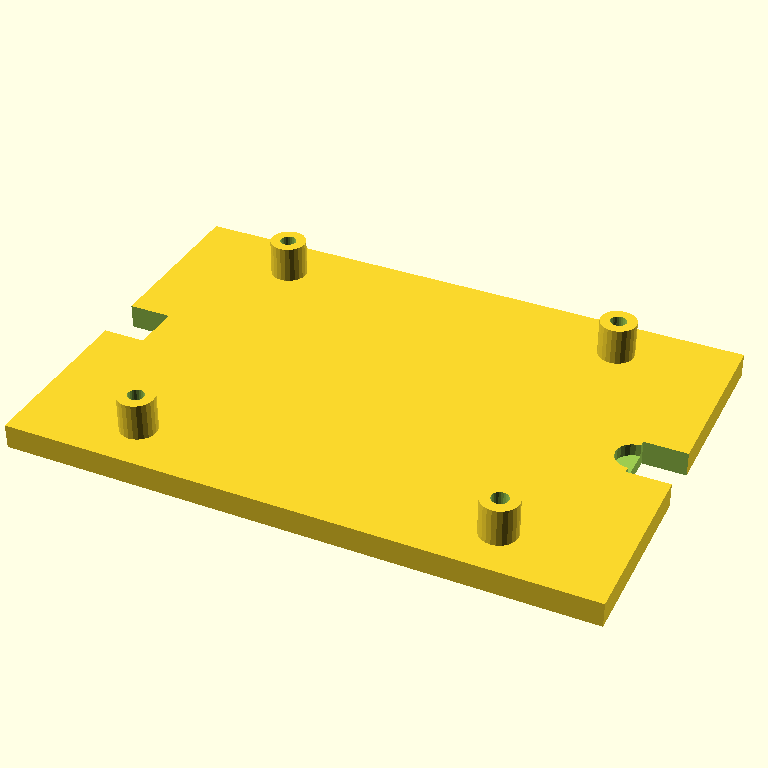

# Pi 5 wall mount — three iterations, no convergence

*2026-05-07 · jmcpheron*

<!-- TODO(jmcpheron): one or two sentences in your voice on what this stage is and why
     it's the credibility test for the demo arc. Suggested beats: SCADvil was the fun
     calibration object; this is the practical part with real Pi 5 dimensions. The
     critic catching real bugs is good; the agent not converging is the talk material. -->

## 01:05 — three iterations, score went 4 → 5 → 4

The Pi 5 wall mount is the dimensional-fidelity demo: 85 × 56 mm board outline, 58 × 49 mm mounting-hole pattern, M2.5 clearance. I gave the agent those numbers explicitly and added the OpenSCAD-cheap-primitives guardrails that worked on the SCADvil. Three iterations ran. None converged.

**Prompt:**

```text
Create an OpenSCAD wall-mount base plate for a Raspberry Pi 5. The point is dimensional fidelity to the Raspberry Pi 5 board.

Required Pi 5 dimensions (use these exactly):
- Board outline: 85 mm × 56 mm
- Mounting hole pattern: rectangular, 58 mm × 49 mm centers
- Mounting holes: 2.7 mm clearance (M2.5)

Build:
- A 95 × 65 × 4 mm rectangular base plate
- Four 6 mm standoffs at the mounting-hole positions
- M2.5 clearance holes (2.7 mm) drilled through each standoff and the base, using a top-level difference()
- Two wall-mount keyhole slots near the short edges, 8 mm wide × 14 mm long

Design constraints:
- Only cube(), cylinder(), translate(), rotate(), and difference()/union() — no minkowski(), no hull()
- $fn = 24 globally
- All holes must be subtractive at the top level (never positive cylinders)
- Sharp corners are fine

Prioritize dimensional accuracy. FDM-printable at 0.2 mm layers, base down, no supports.
```

**The trajectory:**

| iter | render | score | done | summary |
|---|---|---|---|---|
| 0 |  | 4 | False | Standoffs missing — `difference()` carved them away because the holes were drilled before standoffs were unioned in. Slots present but wrong geometry. |
| 1 |  | 5 | False | Standoffs visible and holes drill cleanly through them. Keyhole slots are simple rectangular notches at the plate edges, not real keyhole shapes. Standoff/plate z-overlap (only 2 mm of standoff protrudes above the plate). **This is the iteration we shipped.** |
| 2 |  | 4 | False | Standoffs grew taller and look right, but the keyhole slots regressed into broken partial cuts at the corners. Score dropped, controller stopped on regression. |

Stop reason: `score did not improve`. Three rolls of the dice; each one fixed one bug and broke another. Source: [`models/pi5-wall-mount.scad`](../../models/pi5-wall-mount.scad) — the iter-1 SCAD, verbatim.

## What got better since the SCADvil

Three things to call out:

1. **The critic caught real bugs this time.** On iter-0 it said: *"Standoffs are added as positive geometry after the difference() operation, meaning the clearance holes drilled in the base plate do not align with or pass through the standoffs themselves."* That's an OpenSCAD-aware critique — the same kind Gemma 4 31B gave us in [yesterday's polling experiment](2026-05-07-polling-critics.md), but from Claude this time. Sharper prompt → sharper critic.
2. **No peg-not-hole bug.** All four mounting holes are drilled with top-level `difference()`. The "must be subtractive at the top level (never positive cylinders)" line in the prompt did its job.
3. **The agent recovered from each iteration's bugs.** iter-0's "holes don't pass through standoffs" was exactly fixed by iter-1, which then introduced a different bug (standoff/plate z-overlap), which iter-2 fixed but in fixing it broke the keyhole slots.

## What's still wrong (in shipped iter-1)

- **Standoff/plate z-overlap.** Plate sits at z=0 to z=4. Standoffs sit at z=0 to z=6. They overlap by 4 mm — only 2 mm of each standoff actually protrudes above the plate. A Pi screwed in here would have its underside touching plate material.
- **Keyhole slots are rectangular notches.** No circular "hanging" hole + slot tail. Functions as an edge slot, not a keyhole. You could hang it on a screw if the screw hangs partway out.
- **No board-outline reference.** The mount has no visible registration for where the 85 × 56 board sits — relies entirely on the standoff positions.

## A scadia bug, fixed in this same commit

The first attempt at this run **crashed at iter-1** — the agent's refine pass returned valid SCAD wrapped in a markdown ` ``` ` fence and the renderer fed the backticks straight to OpenSCAD, which choked on `Parser error: syntax error`. Real scadia bug, not a model bug.

Fix: a 7-line `_strip_fence` helper in [`src/scadia/client.py`](../../src/scadia/client.py) that drops the surrounding fence if present. After patching, the 3-iteration run completed cleanly. The bug was in scadia all along; it just hadn't bitten until iter-1 of a model that liked to fence its output.

## What this changes about the loop (or doesn't)

<!-- TODO(jmcpheron): your read on what 4→5→4 means for the demo arc and the talk.
     Some angles to pick from:

     - "Three iterations is enough to learn that one critic + one generator can't
       converge on this artifact" — suggests adding a second sensor (the AST sensor
       discussed in the polling-critics post, or an ensemble critic).
     - "The score going DOWN on iter-2 is a stronger signal than score going up on
       iter-1" — argues the controller's stop-on-regression heuristic is doing the
       right thing; the agent really did get worse.
     - "Scadia is now resilient to ``` fences in iter-N+1 output" — small but real
       improvement to the loop's reliability.
     - The talk slide writes itself: three renders side by side, score below each,
     . "the agent fixes one thing and breaks another. The lesson is that vision-only
       refinement caps out somewhere."
   -->

## What's next

1. Print the iter-1 mount and see if a Pi 5 actually fits. The 4 mm standoff overlap might or might not be a deal-breaker depending on Pi underside topology.
2. Move on to Stage 3 — the retro Pi 5 case. Same constraints, plus aesthetic prompt.
3. Consider whether to wire one of the multi-critic experiment findings into `agent.py` before Stage 3 runs (ensemble gate, AST sensor, or leave it).

## 01:10 — printed object

<!-- TODO(jmcpheron): photo of the printed Pi 5 mount, ideally with an actual Pi 5
     test-fit. Append as a new ## HH:MM section here when the print is done.
     If the Pi doesn't sit flush due to the standoff z-overlap, that's a great
     "AI got the dimensions right, the assembly wrong" talk moment. -->
