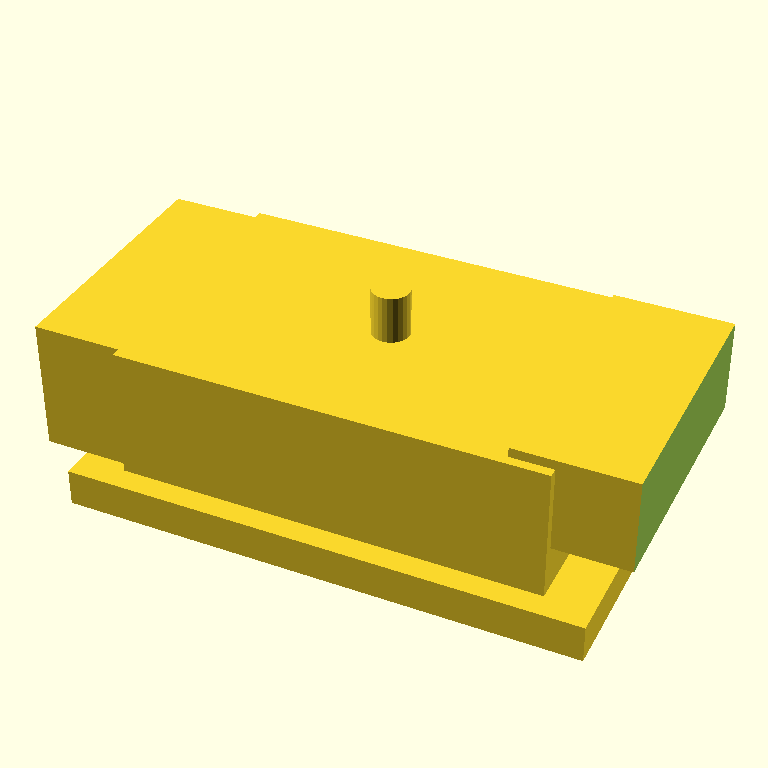

# Polling six critics on the SCADvil

*2026-05-07 · jmcpheron*

<!-- TODO(jmcpheron): one or two sentences in your voice on why this experiment exists.
     Suggested beats — the existing critic gave the buggy SCADvil 8/10 in the live run;
     this poll asks whether other models would have caught what it missed. -->

## 00:47 — six critics, one render, same prompt

The render every model was looking at — this is the SCADvil iter-0 from [yesterday's post](2026-05-07-scadvil-anvil.md), which scored 8/10 with `done=True` in the live agent loop:



I ran this render through `scripts/multi_critic.py`, which sends the same image, the same SCAD source, and the same `SYSTEM_CRITIQUE` prompt to multiple OpenRouter multimodal models, then parses each model's `submit_critique` tool call into the same `Critique` shape the agent loop uses internally.

The script reuses scadia's existing `CRITIQUE_TOOL` schema and prompts — same instructions, same expected output format, just different model inferring on the other side.

| model | done | score | blocking | non-blocking | source | t(s) |
|---|---|---|---|---|---|---|
| `google/gemini-2.5-flash` | False | 4 | 3 | 0 | tool_call | 2.5 |
| `anthropic/claude-haiku-4.5` | False | 7 | 3 | 3 | tool_call | 6.4 |
| `qwen/qwen3-vl-8b-instruct` | False | 4 | 5 | 5 | tool_call | 3.4 |
| `openai/gpt-5-mini` | — | — | — | — | unparsed | 29.8 |
| `meta-llama/llama-4-scout` | — | — | — | — | error (HTTP 429) | 0.7 |
| `google/gemma-4-31b-it` | False | 4 | 1 | 1 | tool_call | 28.2 |

Full per-model output: [`comparison.md`](assets/2026-05-07-polling-critics/comparison.md).

## The headline finding

**Gemma 4 31B IT — the smallest, cheapest model in the lineup — caught Bug 1 with surgical precision.** Its single blocking issue was:

> *blocking:* The 4mm tolerance hole is rendered as a positive cylinder sticking out of the top instead of a hole drilled through the body.

And its `suggested_next_action`:

> Move the `tolerance_hole()` call inside a `difference()` block and ensure it is subtracted from the anvil geometry rather than added to it.

That's not a vague aesthetic note. That is the actual fix, in OpenSCAD vocabulary, naming the actual function in the source. Gemma read the SCAD source and the render *together* and reported a code-level bug. Every other model that responded described "the hole isn't visible" or "the hole isn't in the right place" — circling the symptom but not naming the cause.

## What the others saw

- **`gemini-2.5-flash`** flagged Bug 2 (text on wrong face) and Bug 3 (horn not tapered) sharply, but described Bug 1 only as *"the tolerance hole is not visible or properly placed."* It saw the symptom; it didn't reach the cause.
- **`claude-haiku-4.5` (via OpenRouter)** scored it 7/10 — the most generous of the responding models — and flagged Bug 3 and a fuzzy version of Bug 2. Notably, it did *not* flag Bug 1 at all. Worth comparing with the live agent run earlier today, where the same model gave the same render an 8/10 with **zero blocking issues**. Same model, same render, two API entry points, very different verdicts. That's its own finding.
- **`qwen3-vl-8b-instruct`** flagged the most issues (5 blocking, 5 non-blocking) and was the only model to mention the heel block alignment specifically. It described the text problem as *"rendered as a separate module subtracted from the anvil, but the positioning and shape don't match"* — partially reading the code but not landing on the floating-z bug.
- **`gpt-5-mini`** returned no `tool_calls` and no text content (`finish_reason` stayed inconclusive after 30 s). Either the OpenRouter routing dropped the tool-format hint or the model declined to respond — worth investigating before treating absence as silence.
- **`llama-4-scout`** rate-limited at the upstream provider (HTTP 429). Operational, not informational.

## What this changes about the loop

<!-- TODO(jmcpheron): your take on what the data above means. Some angles worth picking from:

     - The smallest model nailed the subtlest bug. Cheapest critic, best signal on this artifact.
       Does that hold across more artifacts, or is this a one-shot? Worth re-running on the
       Pi 5 wall mount and retro case once those exist.

     - Same model (claude-haiku-4.5) gave done=True / 8 in the live agent loop, then done=False / 7
       through OpenRouter on the same render. The existing critic isn't even self-consistent.
       That's a point about variance, not about model choice — and it argues for an *ensemble*
       gate rather than a single-vote gate, regardless of which model you pick.

     - 4/4 responding models said done=False. The agent loop's controller would have iterated.
       Instead it stopped at iter-0 because the live critic happened to vote done=True. Single
       point of failure in the controller's done check.

     - For the talk: "we ran the same image through six critics. The cheapest one read the code.
       The most expensive one couldn't follow the format." That's a slide.
   -->

## What's next

1. Decide the architecture move based on the data:
   - **A.** Ensemble critic — gate `done` on agreement of two cheap models (e.g. Gemini Flash + Gemma) instead of one critic's vote. Most defensible from this experiment.
   - **B.** Cascade — Claude as primary, escalate to Gemma when score is borderline. Cheapest in expectation.
   - **C.** Add an AST-aware non-vision sensor that detects "module called `*_hole` was union'd, not difference'd" patterns. Would have caught Bug 1 deterministically, no LLM needed. Cheapest of all.
   - **D.** Keep `agent.py` untouched — treat OpenRouter as offline analysis only. Preserves talk-readability.
2. Re-run this poll on the upcoming Pi 5 wall mount once it exists, to see whether Gemma's win generalizes or was artifact-specific.
3. Look into why `gpt-5-mini` returned nothing — likely a tool-format quirk on OpenRouter; potentially fixable.

## How to reproduce

```bash
PROMPT=$(jq -r .prompt output/run-20260507T072032Z/manifest.json)
uv run python scripts/multi_critic.py \
    --render docs/devlog/assets/2026-05-07-scadvil-anvil/render.png \
    --scad   models/scadvil.scad \
    --prompt "$PROMPT"
```

Per-model raw JSON and a fresh `comparison.md` land in `output/experiments/<timestamp>/` (gitignored).
