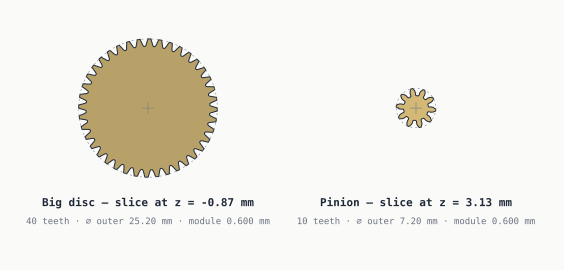
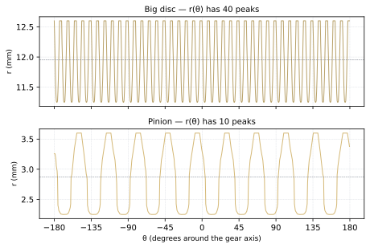
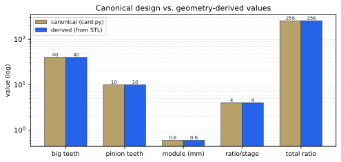
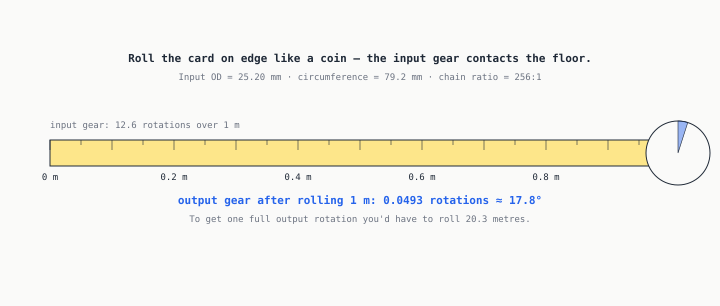
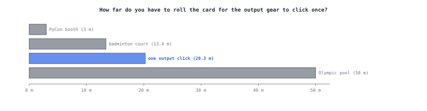

# Decoding the gear card from its bytes

> *[your voice here] one-line hook about pulling design intent out of a STEP that pretends it has none.*

When [Onshape exports a STEP file](card-3d.md), it drops everything that
made the part *parametric*: no gear ratios, no tooth counts, no module,
no mate semantics. What you get is a list of B-rep solids with names like
`Spur gear (40 teeth)` — the only surviving design intent is the
parenthetical, and that's just a string.

This page does the opposite operation: it **recovers** the lost design
intent from the geometry. The numbers below are computed by reading the
committed STL of one gear (`docs/assets/card/parts/Spur_gear_40_teeth_4.stl`),
slicing it at two different heights, and asking each cross-section
"how periodic are you?"

## The fingerprint

A gear's outer boundary, viewed in polar coordinates, is a periodic
signal: the radial distance `r(θ)` rises to a tooth tip then falls to a
tooth valley, repeating every `360°/N`. The dominant frequency of that
signal is the tooth count.



The left panel is a horizontal slice of the part **at z = -0.87 mm**
— inside the big disc. The right panel is the same gear sliced **at
z = 3.13 mm** — inside the pinion that sits on top of the
disc. They're drawn at the same scale, so the size difference is honest.

## The signal

Rendering `r(θ)` as a cartesian plot makes the periodicity obvious — you
can count the peaks by eye:



But we don't need to count by eye. The FFT of `r − mean(r)` puts a
single tall stem at the dominant frequency:


The dominant bin is the tooth count. For the disc: **40
teeth.** For the pinion: **10 teeth.** Onshape's part name was
truthful — and now we've verified it without trusting it.

## Recovering the module

A standard gear's outer diameter is `(N + 2) · module`. With both
quantities measured, we can back-solve:

```text
disc:    derived_module = 2 · 12.600 / (40 + 2)
                        = 0.6000 mm
pinion:  derived_module = 2 · 3.600 / (10 + 2)
                        = 0.6000 mm
```

Both agree to within rounding. Comparing to the canonical value in
[`card.py`](../../src/explainers/card.py):



The derived ratio per stage is `40 / 10
= 4`, and for 5 gears in the chain
(so 4 meshes), the total ratio is
**256:1** — matching the canonical
256:1.

We have now used Python to recover, from raw mesh data, every parameter
Onshape's STEP exporter threw away.

## The rolling-tape thought experiment

Now that we have a verified ratio, the fun question: **if you rolled the
card on edge along a flat surface — like a coin rolling along a counter —
how does the output gear behave?**

The input gear's outer circumference is
`π · 25.20 mm ≈ 79.2 mm`. Rolling
the card one full metre means the input gear makes
`1000 / 79.2 ≈ 12.63` rotations.

Through the 256:1 chain, that becomes:



**0.0493 rotations.** Or, equivalently:
**17.8 degrees**. The output gear barely twitches.

Inverting the question: to get **one full output rotation**, you'd have
to roll the card

`256 · 79.2 mm ≈
20.3 metres`

— roughly the length of an Olympic swimming pool, give or take a few
podiums:



The output gear is a *commitment*. You don't watch it spin; you leave
the room, come back, and check whether it's moved.

## What we used

| Step | Library | Operation |
|---|---|---|
| Load STL | [`trimesh`](https://trimesh.org/) | `trimesh.load(...)` |
| Slice at z | `trimesh.intersections` | `mesh_plane(mesh, ...)` returns segments |
| Bucket to polar grid | `numpy` | `np.maximum.at(r_grid, bucket_idx, r)` |
| Tooth count | `numpy.fft` | dominant bin of `rfft(r − mean(r))` |
| Module back-out | arithmetic | `m = 2·r_outer / (N + 2)` |
| Diagrams | `drawsvg` + `matplotlib` | with `svg.hashsalt` for byte stability |

Zero scipy. Zero hand-tuned thresholds. The FFT does the counting.

## Caveats

- This is a **clean STL** that came from a parametric CAD source. The
  same pipeline run on a scanned-and-meshed gear would need denoising
  and a less idealised peak detector.
- The rolling-tape math assumes pure rolling without slip and lossless
  meshes. The actual printed card will bind from friction and tolerance
  stack-up well before you've rolled 20 metres.
- We sampled exactly one of the gear instances (the tall-hub variant
  at index 4). All five instances are geometrically identical except
  for the hub length, which doesn't affect tooth count or outer
  diameter, so the result generalises.

---

*Generated by [`src/explainers/decoding.py`](../../src/explainers/decoding.py).
Edit the source, not this file.*
