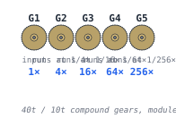
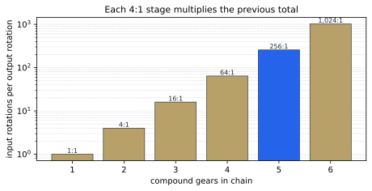
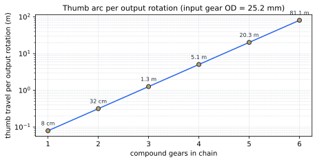

# Gear ratios — spinning once into spinning almost never

> *[your voice here] one-line hook about why this card has a wildly impractical reduction chain.*




## The compound gear, briefly

Each gear in the chain is one printed part: a **big disc** (40 teeth at module 0.6 mm, pitch ⌀ 24 mm) bonded to a smaller **pinion** (10 teeth, pitch ⌀ 6 mm) that rotates with it on a shared post. When the pinion of gear *N* meshes with the big disc of gear *N+1*, gear *N+1* spins 4× slower. Stack 5 of them in a row and the slow-down compounds.

## The math, in three lines

```text
ratio_per_mesh = big_teeth / pinion_teeth = 40 / 10 = 4
total_ratio    = ratio_per_mesh ^ (N_gears − 1)
               = 4^4 = 256:1
```

The `−1` is because *N* gears have *N−1* meshes — the input gear isn't being driven by anything, it just provides the entrance to the chain.



A linear add of one gear *multiplies* the cumulative ratio. Log scale on the y-axis is the only reason all six bars fit on one chart.

## Thumb travel

The fun framing isn't "input rotations per output rotation" — it's how far your thumb actually travels along the rim of the input gear before the output makes one full turn. The big disc has outer diameter 25.2 mm, so one full input rotation drags your thumb 79 mm along the gear's edge. Multiply by the total ratio:



With our 5-gear chain (256:1), that's roughly **20.3 m of thumb arc per output click**. At one comfortable thumb-flick per second, you'd be flicking the input for ≈ 4 minutes to make the output disc complete a single revolution.

## Why we picked 5 gears

| Stages | Ratio | Thumb travel | Footprint (post-to-post) |
|--------|-------|--------------|--------------------------|
| 3 | 16:1 | 1.3 m | 30 mm |
| 4 | 64:1 | 5.1 m | 45 mm |
| 5 | 256:1 | 20.3 m | 60 mm |
| 6 | 1,024:1 | 81.1 m | 75 mm |

The card body is 88.9 × 50.8 mm, and the chain has to leave room for the input thumbwheel, the output indicator, and a bit of branding. 5 gears at 15 mm spacing fits cleanly with margin to spare; six pushes into the corners; seven needs an extended card.

## What's next

The ratio math is the easy part. The hard part — once you've decided on a number — is *physically arranging* 5 gears so adjacent ones can mesh without their big discs running into each other. That's [the next explainer](stacking.md).

---

*Generated by [`src/explainers/ratios.py`](../../src/explainers/ratios.py). Edit the source, not this file.*
