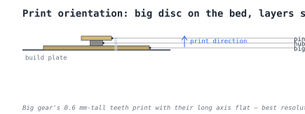
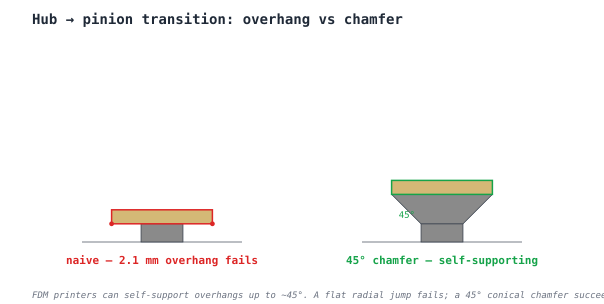
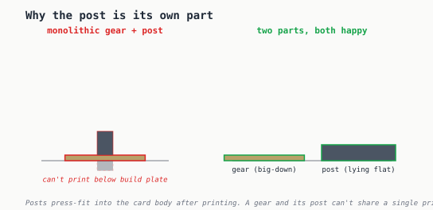

# 3D-printing considerations — designing for the printer, not just the function

> *[your voice here] this is the section where you note that the engineering of how it works is only half the problem; the other half is making it actually come off the build plate intact.*

## Print orientation: big disc on the bed

The compound gear has a single sane orientation: **big disc flat on the build plate, hub up, pinion on top**. Two reasons:

1. **Tooth resolution.** The 40-tooth big gear's teeth are 0.6 mm tall radially. Printed flat on the bed, that detail lives in the *layer plane*, where the printer's resolution is set by extrusion width (~0.4 mm) — sharp. Printed standing up, that detail would be sliced into 6 stacked layers per tooth and lose the curve to staircase artifacts.
2. **Self-supporting tower.** The hub above the big gear is a vertical cylinder — cleanest possible shape for FDM. No bridges, no overhangs, no support material.

At 0.1 mm layer height, the 1 mm big gear is 10 layers; the 1 mm pinion is also 10 layers. Plenty of structural mass.

## The hub-to-pinion overhang

This is the one place the simple "big-disc-on-bed" orientation fights you. The hub is 3 mm wide; the pinion above it is 7.2 mm wide. That's 2.1 mm of radial overhang per side, with no support beneath.

A flat overhang of 2.1 mm sags or curls — FDM filament can't span empty space sideways without something underneath. Two options:

- **Add a 45° chamfer** between the hub and the pinion. Each layer of the chamfer is supported by the layer below, all the way up to the full pinion radius. No support material, no print failure.
- **Use a tree-support generator** during slicing, and pay for support removal time afterward.

The chamfer wins. It's a couple of seconds in CAD, doesn't cost any height (the chamfer is "above" the hub but the pinion sits on top of it, so total height is unchanged), and the result is a printer-friendly self-supporting form.

## Why the post is its own part

The post — the axle the gear spins on — needs to extend *below* the gear to seat into the card body. If you tried to print the gear and post as one part, you'd be asking the printer to either start the post hovering in mid-air below the build plate (impossible) or flip the gear upside-down so the post stub points up (which puts the 0.6 mm-tall teeth standing up — the bad orientation).

Two separate parts solves it cleanly:

- **Gear** prints big-down, hub up, pinion on top. Best orientation for tooth resolution.
- **Post** prints lying flat on the bed. Just a 2 mm × ~9 mm cylinder — trivial.

After printing, posts press-fit into pre-drilled holes in the card body (or print into a card with the holes built in). Gears slide down onto the posts, optionally with a tiny printed cap on top to keep them from lifting off.

## A practical settings table

| Setting | Value | Rationale |
|---------|-------|-----------|
| Layer height | 0.1 mm | 6 layers per 0.6 mm tooth height — clean detail |
| Walls | 4–5 perimeters | Tiny parts; you want them solid |
| Infill | 50–100 % | Doesn't matter for time, helps strength |
| Supports | none | The chamfer eliminates the only overhang |
| Material | PLA or PETG | PLA is fine for a non-loadbearing demo; PETG wears better |
| Brim | 5 mm if needed | The pinion's small footprint can pop loose |

## Putting it together

Printing four standard parts and one tall-hub variant takes about 25 minutes in PLA at 0.1 mm layers, plus the time to print the card body and posts. Total assembly is press-fit with no glue: posts into card, gears onto posts, optional pointer onto the output gear's pinion, done.

[← Back to gear ratios](gear-ratios.md) · [back to index](index.md)

---

*Generated by [`src/explainers/printing.py`](../../src/explainers/printing.py). Edit the source, not this file.*
