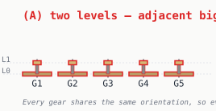
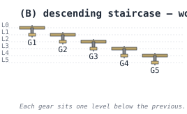
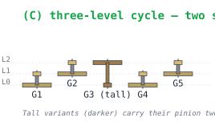
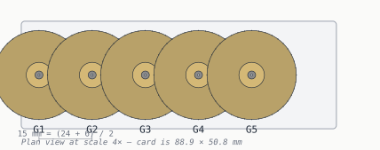

# Stacking — fitting 5 compound gears in a 5 mm card

> *[your voice here] this section is the one where the chat conversation actually went somewhere. Spoiler: 2D layout fails, brute-force stair-stepping works but bloats the card, and the right answer is a 3-level cycle.*

## The constraint

Two compound gears mesh when one's pinion lines up with the other's big disc — same height, different post. That part's straightforward. The trouble starts when you ask: where does each gear's *other* part go? And, more painfully: where do the *non-meshing* parts of every other gear in the chain end up?

You only have a few millimetres of card thickness to work with (5 mm here, with 1 mm gear plates and 0.3 mm clearance between layers). Every level you add is a budget line item.

## (A) Two levels, naive — doesn't work

The first instinct is: put every gear in the same orientation. Big disc on the bottom, pinion on top. Two levels total. Stack them in a row.



The pinions all live at L1 and the big discs all live at L0, which is *fine* for meshing (each gear's pinion at L1 has the next gear's big disc to mesh with) — except adjacent big discs are now occupying the same horizontal level *and* are close enough to physically intersect at the mesh point. Nothing turns.

## (B) Descending staircase — works, but expensive

The brute-force fix: put every gear one level lower than the previous one. No two big discs ever share a level, no collisions anywhere.



This works, but **5 gears now need 6 levels of vertical space** — every additional gear thickens the card. At the canonical 1 mm gear plate plus 0.3 mm gap, that's 7.8 mm just for the stack. The card has to be thicker than the chain plus floor and cap. Six gears overshoots a 5 mm card.

## (C) Three-level cycle — two standard parts, one tall — works *and* doesn't grow

Here's the trick that came out of the chat conversation, eventually: introduce a special **tall-hub** variant of the gear. Its hub is long enough to span two levels of vertical clearance. Use it once every three gears, and the chain returns to its starting configuration after each cycle.



The cycle in pictures:

| Gear in cycle | Big disc level | Pinion level | Part type |
|---------------|----------------|--------------|-----------|
| 1 (G1, G4, G7…) | L0 | L1 | standard |
| 2 (G2, G5, G8…) | L1 | L2 | standard, mounted up one level |
| 3 (G3, G6, G9…) | L2 | L0 | **tall-hub** (pinion vaults two levels down) |

After three gears you're back at L0, ready to start the next cycle. The card stays at three levels of vertical stack regardless of gear count: 5 gears, ten gears, twenty gears — same 3-level card.

You only need **two unique printed parts**: the standard one (hub spans 1 clearance) and the tall one (hub spans 2 clearances). For a 5-gear chain you print 4 standard and 1 tall.

## Plan view

Spacing — the part where the meshing actually has to be physically possible — is set by the standard gear-mesh formula:

```text
center_distance = module × (big_teeth + pinion_teeth) / 2
                = 0.6 × (40 + 10) / 2
                = 15 mm
```

That's the post-to-post distance for every adjacent pair. Five gears = four meshes = 60 mm of horizontal post span.



The big discs visually overlap in plan view at the mesh point — that's *intended*. The teeth interlock at the pitch circle. Cross-section (C) above proves the discs are at different *heights*, so there's no physical collision; the overlap is just the shadow when you look down at it.

## Why this matters in practice

You can solve the same problem by laying the chain out in 2D — bend it into an L-shape, route around an obstacle, etc. — but a straight run is cleaner to print, cleaner to assemble, and reads better on a 88.9 × 50.8 mm rectangle. The 3-level cycle is the smallest design that lets a straight chain stay straight.

[Next: terminology — naming all the parts you've been pointing at →](terminology.md)

---

*Generated by [`src/explainers/stacking.py`](../../src/explainers/stacking.py). Edit the source, not this file.*
