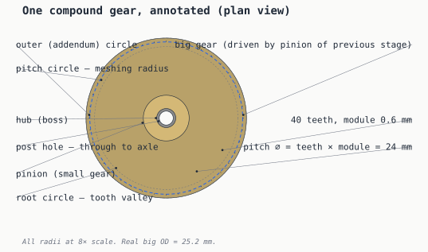
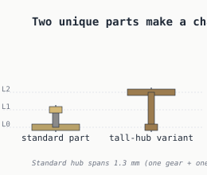

# Terminology — naming the parts

> *[your voice here] a paragraph explaining that the chat conversation kept tripping over which thing was called what, and that consolidating vocabulary up front saved a lot of back-and-forth later.*

## One compound gear, named



Every gear in the chain is the same shape: a **big gear** stacked above a smaller **pinion**, sharing a **hub** that wraps the **post hole**. When two gears mesh, the meeting actually happens on their **pitch circles** — that imaginary circle where the teeth would slide against each other if they were friction wheels. The visible outer edge — the **outer circle** — is just one tooth-height beyond that.

The math each diagram leans on:

```text
pitch_diameter = teeth × module          # the meshing reference circle
outer_diameter = pitch_diameter + 2 × module
root_diameter  = pitch_diameter − 2.5 × module
center_distance = (pitch_dia_a + pitch_dia_b) / 2
```

For our canonical 40t / 10t pair at module 0.6 mm:

| Feature | Big gear | Pinion |
|---------|---------:|-------:|
| Teeth | 40 | 10 |
| Pitch ⌀ | 24 mm | 6 mm |
| Outer ⌀ | 25.2 mm | 7.2 mm |
| Root ⌀ | 22.5 mm | 4.5 mm |

## Two parts cover any chain length



The whole chain comes from two unique printed designs — same big gear, same pinion, same hub diameter, different hub *length*. The tall-hub variant shows up once every third position to drop the next pinion two levels at once and keep the chain from staircasing forever (see [stacking](stacking.md) for the why).

## Glossary

| term | definition |
|------|-----|
| **big gear** | The larger of the two toothed wheels on a compound gear part. Driven by the pinion of the previous stage. |
| **pinion** | The smaller toothed wheel on the same shaft as the big gear, sharing rotation. Drives the next stage's big gear. |
| **hub (boss)** | The cylindrical spacer between big gear and pinion that sets their vertical separation. Length determines whether a part is the 'standard' or 'tall-hub' variant. |
| **post (axle, arbor)** | The vertical pin pressed into the card body that the gear rotates around. 'Post' in this writeup; 'axle' in mechanical engineering; 'arbor' in clockmaking. |
| **post hole** | The through-bore in the gear hub that fits over the post with enough clearance for free rotation. |
| **pitch circle** | The imaginary circle where two meshing gears would touch if they were friction wheels. Tooth count × module / 2 = pitch radius. |
| **module** | The size of one tooth, expressed as pitch diameter per tooth in mm. Two gears mesh only if their modules match. |
| **addendum** | The radial distance from the pitch circle to the top of a tooth. Equals the module. |
| **dedendum** | The radial distance from the pitch circle down to the root circle. Slightly larger than the addendum (×1.25) for clearance. |
| **outer (addendum) circle** | The actual outer boundary of the gear — pitch circle plus addendum. What you'd measure with calipers. |
| **root circle** | The bottom of the tooth valleys — pitch circle minus dedendum. |
| **center distance** | Post-to-post spacing for a meshing pair. (big_pitch_⌀ + pinion_pitch_⌀) / 2. |
| **compound gear** | A single rigid part holding both a big gear and a pinion on a shared hub. The two halves rotate together. |
| **level** | A horizontal band of card thickness where a gear plate sits. Three levels cover any chain length when paired with a tall-hub variant every third gear. |

## A note on which word to use

The same physical thing has different names in different traditions:

- The vertical pin is a **post** in this repo, an **axle** in general mechanical engineering, an **arbor** in clockmaking and watchwork. They mean the same part. This writeup uses *post* throughout because it's the shortest word that's unambiguous in the context of a 3D-printed assembly.
- The cylindrical spacer is a **hub** here; you'll also see it called a **boss** in injection-mould literature, particularly when it's an integral feature of a larger part.
- A *pinion* is just a small gear in a context where there's a bigger gear to compare it to. There's no fixed tooth count that makes something a pinion; it's relational.

[Next: print considerations — how to actually 3D-print these parts →](printing.md)

---

*Generated by [`src/explainers/terminology.py`](../../src/explainers/terminology.py). Edit the source, not this file.*
