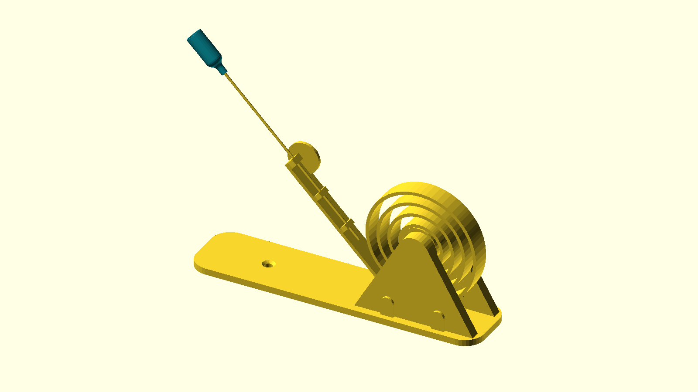
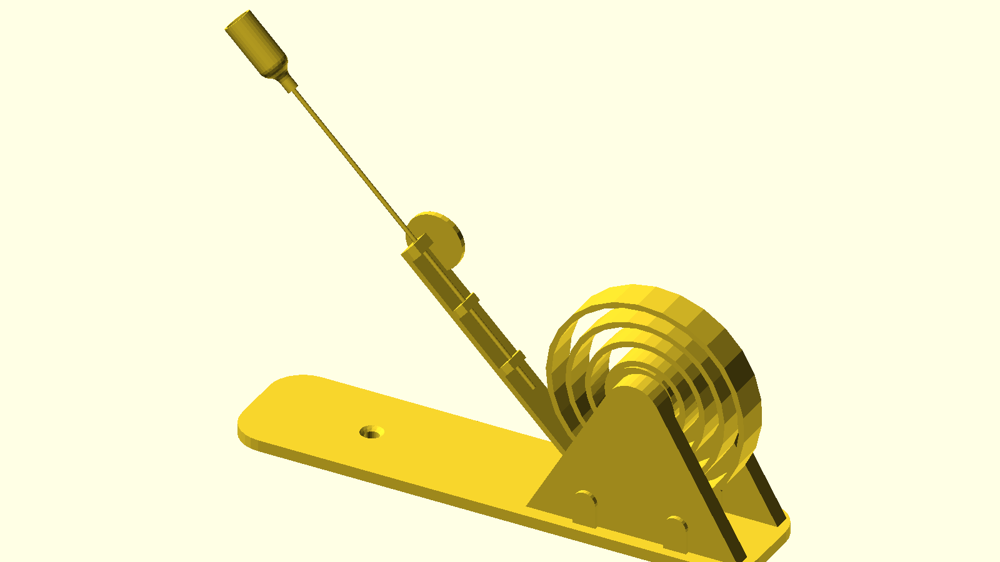
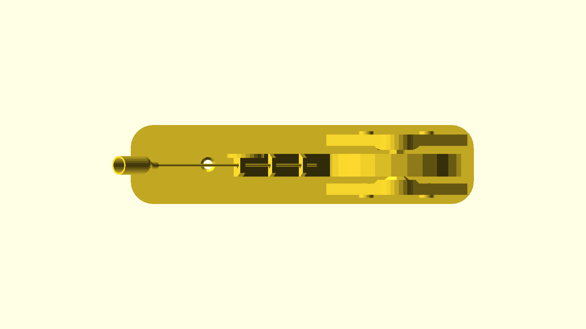
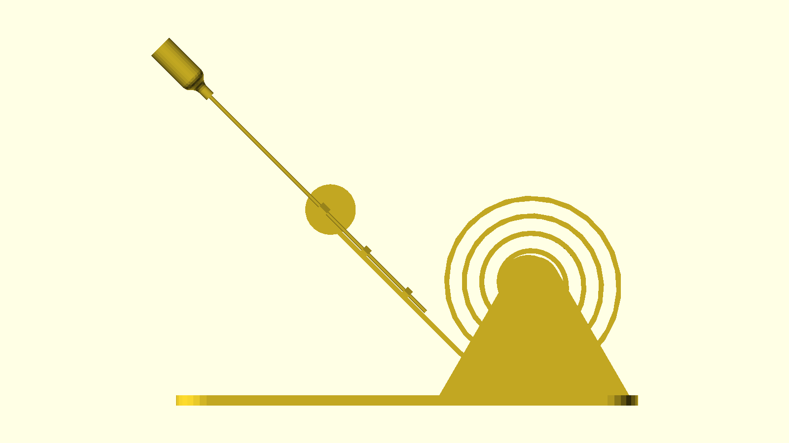
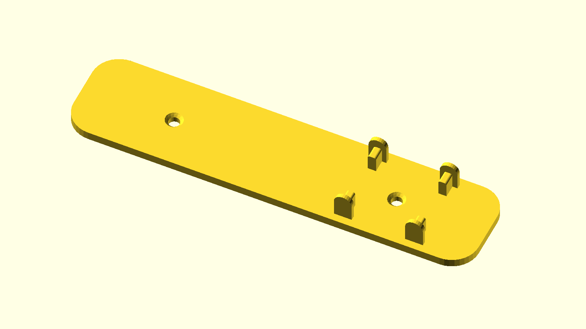
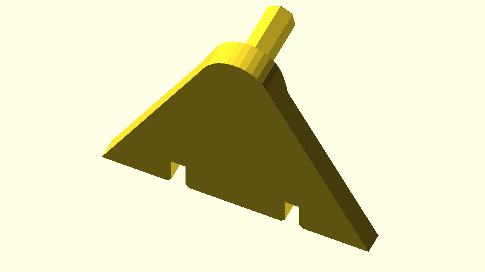
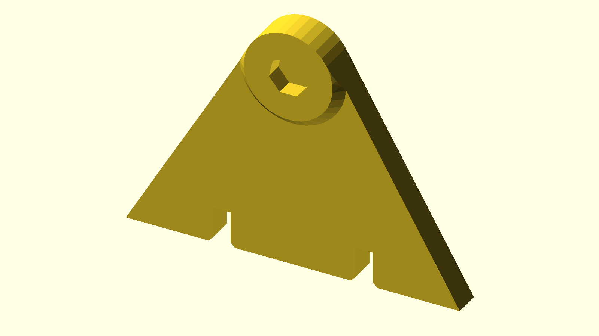
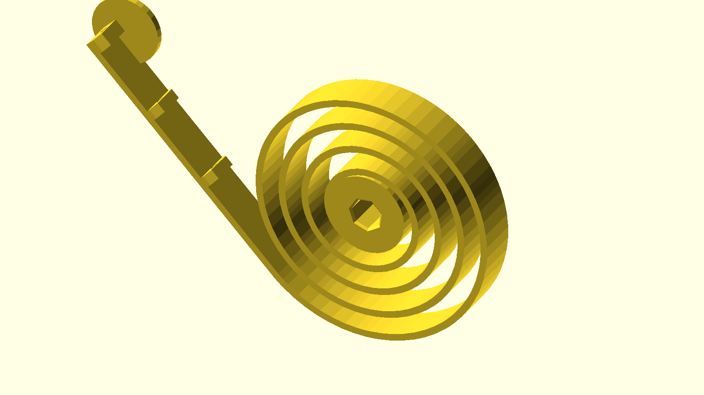
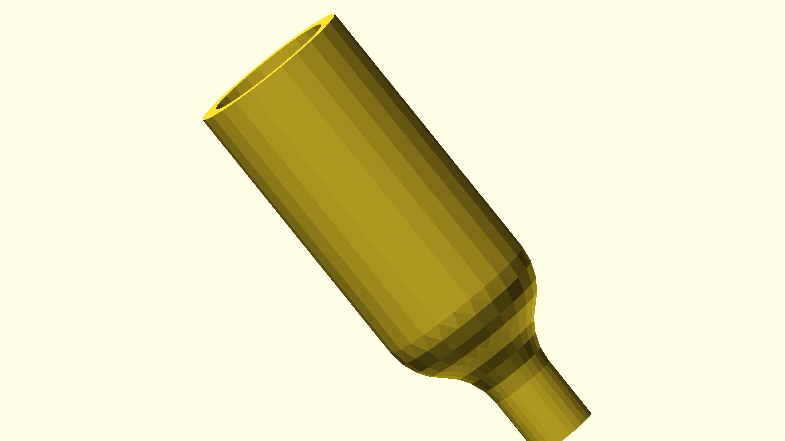
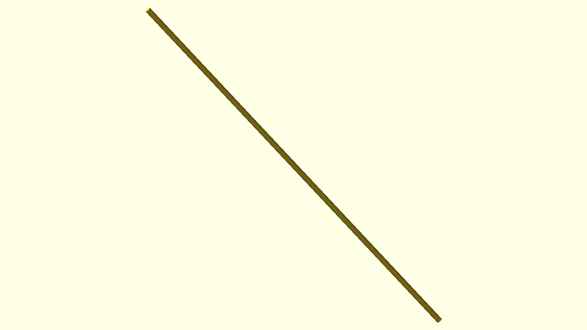

# Pounce-a-Pult — a spiral-spring cat toy, run through the Python pipeline



> A flat spiral spring that flexes and rebounds when your cat swats it.
> One tap sends the spiral wobbling and twisting before it settles back,
> ready for the next round.

## What it is

The arm is a *flat spiral spring* — laid flat in the print bed, so it
comes off the printer ready to flex out-of-plane. Its free end carries
a small cup sized for a thin straight rod (a straightened coat hanger
works perfectly). Tape a feather to the rod and the assembly becomes a
self-resetting swatting target that moves in a way cats seem to find
endlessly interesting. The base is a long flat plate and two triangular
support brackets that hold the spring vertical.

## Where to get one

The pounce-a-pult is meant to be shared, printed, and remixed. Two
entry points live upstream of this repo:

- **Print one.** The published bundle on MakerWorld has the slicer
  profile, photos in the wild, and remix notes — the easiest path to a
  working toy:
  [makerworld.com/en/models/2138778-pounce-a-pult-spiral-cat-toy](https://makerworld.com/en/models/2138778-pounce-a-pult-spiral-cat-toy#profileId-2316710).
- **Remix the CAD.** The design lives in a public Onshape document —
  open it in any browser to spin it around, then click "Make a copy"
  into a free Onshape account to change the geometry directly (a
  longer base, taller brackets, a different polygon on the spring
  socket):
  [cad.onshape.com/documents/01739d2a63dc91eaf28c2c62](https://cad.onshape.com/documents/01739d2a63dc91eaf28c2c62/w/a7c671d651186a5272cc789f/e/fdb2542c5ccec8040d59912a).

Both are upstream of this repo. The files under
[`step-demo/`](../../step-demo/) are just the exported STEP plus
everything [`cardlab`](../../src/cardlab/) derives from it.

## Hero renders

| Iso | Top | Edge |
|---|---|---|
|  |  |  |

Rendered by `cardlab render` (OpenSCAD-backed orthographic projection)
at the iso / top / edge presets from
[`src/cardlab/render.py`](../../src/cardlab/render.py).

## V2 upgrades (from the upstream changelog)

- **Chamfered mounting holes** through the base plate so you can bolt
  this thing to a wall, desk, cat tree, or any nearby surface brave
  enough to host it.
- **Heptagon socket on the spring mount** — 7 sides instead of 2, so
  there are *seven* discrete angle options for clocking the spring
  into the base instead of just two. When the spring starts to sag
  after months of high-impact cat shenanigans, just rotate it to a
  fresh face: more tuning options, better wear spread, and an easy
  way to dial in the perfect amount of bounce.

## Assembly

- Designed for a **~1.6 mm rod**. A straightened coat hanger works
  great. Straightened PLA filament or any similar stiff plastic rod
  will also do the job.
- Add a feather, puffball, or string to the end of the rod with glue,
  a knot, or a snug friction fit. Cat preference, not engineering.
- The brackets slot onto the base plate; the spring's heptagon socket
  registers it to one of seven angles between them. No fasteners
  required for the basic build; M-screws into the chamfered base
  holes if you're wall-mounting.

## Printing

- **PLA or PETG** recommended.
- **No supports** required.
- **Prints flat on the build plate.** The spiral arm is what makes
  this design work — print it lying down so the layers run radially
  along the spring's length, not across it. Cross-grain layers crack
  on the first hard swat.

## Part-by-part breakdown

`cardlab explode` decomposes the STEP into 6 solids, renders each one
in isolation, and writes the colour + centroid + displacement vector
to [`assets/manifest.toml`](assets/manifest.toml).

| Render | Part | Bbox (mm, X × Y × Z) | Notes |
|---|---|---|---|
|  | `Part_1_2` | 182 × 42 × 16 | Long flat base plate — the longest part on the long axis. |
|  | `Part_1_3` | 75 × 28 × 55 | One of the triangular support brackets. |
|  | `Part_1_1` | 75 × 8 × 55 | The mirror-twin support bracket. |
|  | `Part_1_4` | 125 × 12 × 78 | The flat spiral arm — the part that flexes. |
|  | `Part_1` | 25 × 10 × 25 | The rod-holder cup at the free end of the spring. |
|  | `Part_1_5` | 86 × 1.5 × 86 | The thin square reference plate visible in the upstream Onshape doc. |

Dimensions come straight from the STEP's bounding boxes in
[`assets/manifest.toml`](assets/manifest.toml); the captions are my
read of what each slot is for. The full per-part STL + GLB live next
to the PNGs in [`assets/parts/`](assets/parts/) so you can pull any
single part into Bambu Studio or Onshape.

## Inspect output

The full AP242 tree, bounding box, and tessellation stats are in
[`inspect.txt`](inspect.txt) — produced by `cardlab inspect
step-demo/pounce-a-pult.step`. Useful if you want to confirm units,
schema, or originating CAD system before re-mixing.

## How this page is built

```
step-demo/pounce-a-pult.step  ──►  cardlab inspect  ──►  inspect.txt
                              ──►  cardlab render   ──►  assets/{iso,top,edge}.png
                              ──►  cardlab explode  ──►  assets/exploded.{glb,gif}
                                                         assets/manifest.toml
                                                         assets/parts/*.{stl,glb,png}
```

The exact same `build123d` + `cascadio` + `trimesh` + OpenSCAD + Pillow
pipeline that powers the [gear card's exploded GIF](../assets/card/exploded.gif)
and the [vault mechanism animation](../vault/assets/vault-hero.gif). No
asset-specific code — the only thing that changes between projects is
the input STEP file and the displacement strategy. See
[`ACKNOWLEDGMENTS.md`](../../ACKNOWLEDGMENTS.md) for the full
upstream-library credit list.

CI re-runs the full pipeline on every push that touches
`step-demo/**.step` or `src/cardlab/**`, via
[`.github/workflows/build-step.yml`](../../.github/workflows/build-step.yml),
and auto-commits the regenerated artefacts back to `main`.

## Source · license

The pounce-a-pult design is **not mine**. It comes from upstream:

> **Pounce-a-Pult — Spiral Cat Toy**, by a
> [MakerWorld designer (profile 2316710)](https://makerworld.com/en/models/2138778-pounce-a-pult-spiral-cat-toy#profileId-2316710),
> shared under the
> [Creative Commons Attribution 4.0 (CC BY) licence](https://creativecommons.org/licenses/by/4.0/).

Two upstream locations are canonical and worth crediting separately:

- The **parametric CAD source** is a [public Onshape document](https://cad.onshape.com/documents/01739d2a63dc91eaf28c2c62/w/a7c671d651186a5272cc789f/e/fdb2542c5ccec8040d59912a) — this is where the geometry actually *lives* (sketches, features, parameters). Fork it there if you want to change the shape of anything.
- The **printable bundle** is the [MakerWorld page](https://makerworld.com/en/models/2138778-pounce-a-pult-spiral-cat-toy#profileId-2316710) — slicer profile, photos, assembly tips, and a place to leave the designer a like.

The `step-demo/pounce-a-pult.step` file in this repo is the
designer's STEP export from that Onshape document, redistributed
under the same CC BY licence. Every render in this folder
(`docs/pounce-a-pult/assets/*.{png,gif,glb}` and `parts/*`) is a
derivative work of that STEP file, so it inherits **CC BY 4.0** with
attribution to the upstream designer — distinct from the rest of this
repo's [`LICENSE-3D-FILES`](../../LICENSE-3D-FILES) (CC BY-SA 4.0).

If you remix the toy, please carry the same attribution forward.

---

*Generated by `cardlab` from `step-demo/pounce-a-pult.step`. The toy
itself is upstream; this page just runs the Python pipeline against
it.*
