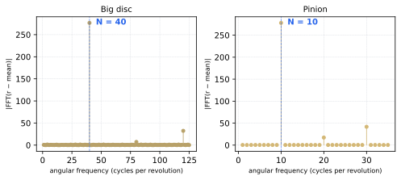

<!-- _class: lead -->

## I Made a Gearbox Business Card,<br>Then Made Python Explain It

**Jason McPheron** · PyCon US 2026 · Lightning Talk

<!--
Hi, I'm Jason, and this is my first PyCon. I work in IT for a community college here in California. This talk is about what I do when I'm supposed to be relaxing: 3D printing little mechanical things and then overthinking them. I wanted something physical to hand people here, so I made a business card with a gear mechanism in it. If I gave you one, you're holding it.
-->

---

# A 3D-Printed Business Card

<div class="two-col">
<div>

- First PyCon — needed a conversation starter
- Credit-card size: 88.9 × 50.8 × **5mm**
- Two printed halves, five compound gears
- Input: your thumb. Output: barely moves.

</div>
<div>


</div>
</div>

<!--
Two printed halves, five compound gears snapping into pockets, a small pinion sticking out the right edge for your thumb. I wanted something I could hand people and use as an excuse to start conversations.
-->

---

# 4:1 × 4:1 × 4:1 × 4:1 = 256:1

- Big gear: **40 teeth**. Pinion: **10 teeth**. Each mesh = **4:1**
- Four meshes → 4⁴ = **256:1 total**
- ~45 metres of thumb travel per output revolution


<!--
Each pinion drives the next big gear. 10 teeth into 40 is 4:1. Four meshes in a row gives you 4 to the fourth: 256. In this animation the input gear on the left is a blur; the output gear on the right barely twitches. You'd need to move your thumb about 45 metres — the length of a pool — to rotate it once.
-->

---

# Puzzle 1 — How Do You Keep It 5mm Thick?

<div class="two-col">
<div>

**Naive 2-level layout**


Big discs collide at the mesh point

</div>
<div>

**3-level cycle — the actual solution**


Two standard gears + one tall-hub variant, repeat

</div>
</div>

5 gears, 50 gears — **still 3 levels, still 5mm**

<!--
If you put all five gears at the same vertical level, the big discs physically overlap at the mesh point — nothing turns. The obvious fix is a descending staircase, but then the card keeps getting thicker with each gear you add. The actual solution is a 3-level cycle: two standard gears, then one tall-hub variant that vaults back to level zero. Five gears, ten gears, doesn't matter — still three levels, still five millimetres.
-->

---

# Puzzle 2 — Recover Tooth Count from Raw Geometry

- STEP export strips all parametric metadata — just B-rep solids
- Slice the STL at two heights → radial profile **r(θ)**
- FFT the signal → dominant frequency = **tooth count**



<!--
When Onshape exports STEP it strips everything parametric — no tooth counts, no module, just named geometry. So I wrote a page that recovers design intent from raw geometry. Slice the STL, sample the radial profile around the gear axis, FFT it. One spike at bin 40. That's your tooth count. The math just works, no special signal processing libraries, just numpy.
-->

---

# Two Python Packages, One STEP File

<div class="two-col">
<div>

**`cardlab`** — reads the STEP file

- `inspect` — AP242 assembly tree
- `render` — orthographic PNGs
- `explode` — per-part STL/GLB/GIF
- `spin` — gear chain animation

</div>
<div>

**`explainers`** — reads `card.py`

- SVG diagrams (drawsvg)
- Matplotlib charts
- Markdown pages
- CI auto-commits everything

</div>
</div>

<!--
cardlab takes the STEP file and produces 3D renders, an exploded GIF, and a parts manifest. explainers goes the other direction: reads a single constants file and emits all the diagrams and markdown pages. Change one number, CI regenerates everything.
-->

---

# One File Drives Everything

```python
# src/explainers/card.py — the single source of truth
BIG_TEETH    = 40
PINION_TEETH = 10
N_STAGES     = 5

RATIO_PER_STAGE = BIG_TEETH / PINION_TEETH           # 4.0
TOTAL_RATIO     = RATIO_PER_STAGE ** (N_STAGES - 1)  # 256.0
```

- Every SVG, every markdown page, every GIF reads from here
- Tests enforce: no hardcoded literals in explainer output
- Change `N_STAGES = 6` → ratio becomes **1024:1**, card still **5mm**

<!--
The constants file is the single source of truth. Those five lines define the entire gear geometry. The test suite even enforces that no explainer page contains a hardcoded literal — if you hardcode 40 instead of card.BIG_TEETH, CI catches it. Change N_STAGES to 6 and CI regenerates a 1024:1 card.
-->

---

# The Repo Explains Itself

<div class="pipeline">

`jmcpheron-card.step` &nbsp;→&nbsp; `cardlab` &nbsp;→&nbsp; `docs/assets/card/` &nbsp;*(renders, GIFs)*

`src/explainers/card.py` &nbsp;→&nbsp; `explainers build` &nbsp;→&nbsp; `docs/explainers/` &nbsp;*(SVGs, pages)*

`docs/` &nbsp;→&nbsp; `pages.yml` &nbsp;→&nbsp; **GitHub Pages**

</div>

- 3 GitHub Actions workflows — disjoint output paths, no conflicts
- Push a new STEP export → GIFs update within a minute
- Edit `card.py` → all explainer pages regenerate

<!--
Three workflows run automatically. They write to completely separate paths so they never conflict. Push a new Onshape export and the hero GIF updates within a minute. I haven't touched any of those generated files by hand.
-->

---

# What Surprised Me

- Making the object was **easy**. Making Python **explain** the object was the fun part.
- FFT for tooth counting — no special libraries, just NumPy
- A 78-line constants file turned out to be a better design document than any CAD annotation I could have written

<br>

*The design started in Onshape. Python came in afterward — around the edges. But that's where all the interesting stuff ended up.*

<!--
The hard part wasn't the gear design — it was making the tooling explain what the physical object is doing. The FFT tooth-counting is the one moment where I thought: okay, this is actually a little clever. And card.py turned out to be the most useful document in the whole project.
-->

---

# Find Me on the Floor

<div class="two-col">
<div>

- Python ↔ CAD pipelines (STEP → build123d → OpenSCAD → GIF)
- Print-in-place geometry tricks
- Open-source licensing for physical 3D files *(CC BY-SA — did I get that right?)*

</div>
<div>


</div>
</div>

<!--
If any of this sounds interesting — Python gluing into CAD, print-in-place mechanisms, or whether CC BY-SA is the right license for a mechanical STEP file — come find me. I will talk about it much longer than five minutes.
-->

---

<!-- _class: lead -->

# github.com/jmcpheron/pycon2026

<div class="qr-wrap">


**I have cards — ask for one.**

</div>

<!--
Scan this or search my GitHub handle. I have physical cards — ask me for one. Thanks.
-->
