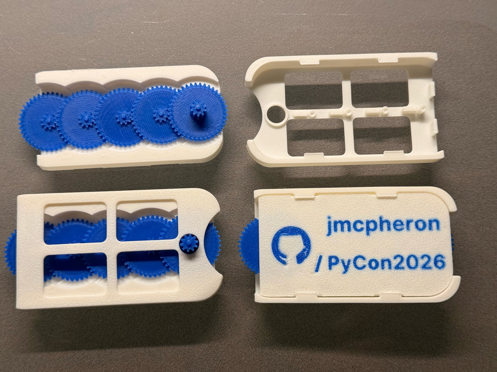
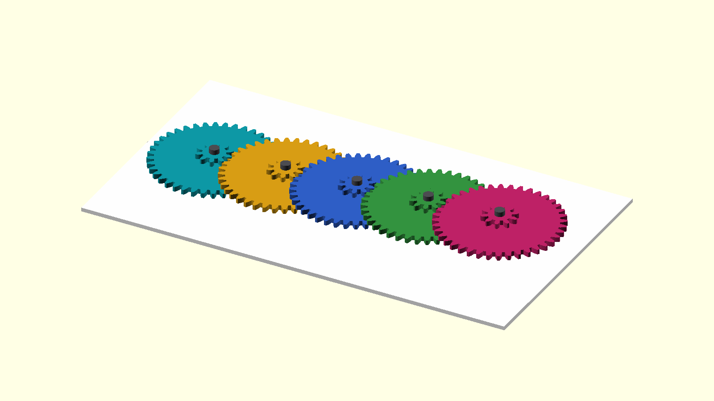

<!-- _class: lead -->

## I Made a Gearbox Business Card, Then Made Python Explain It

**Jason McPheron** · PyCon US 2026 · Lightning Talk

<!--
[walk up, hold up the card if you have one]
-->

---

# Hi, I'm Jason.

- IT work, California community college — mostly student systems
- This talk is about what I do when I should be relaxing: **3D printing little mechanical things and then overthinking them with Python**
- First PyCon — wanted something physical to bring
- Something more interesting than "here's my GitHub"

<!--
I work in IT for a community college here in California, mostly around student systems.

But this talk is about one of my hobbies, which is 3D printing little mechanical things and then overthinking them with Python.

This is my first PyCon, and I wanted to make something physical to bring with me.

Partly because 3D printing is fun. Partly because I like making small mechanical objects. And partly because conferences full of strangers can be a little intimidating, so I wanted a conversation starter.

Something I could hand someone that was more interesting than just saying, "Here's my GitHub."
-->

---

# So I made a 3D printed business card.

It has my GitHub project on it.

It also has a **tiny gear mechanism** built into it.

You can spin one gear with your thumb, and the motion moves through the card.

Part business card. Part fidget toy. Part tiny mechanical demo.

<!--
It has my GitHub project on it, but it also has a tiny gear mechanism built into it. You can spin one gear with your thumb, and the motion moves through the card.

It is part business card, part fidget toy, and part tiny mechanical demo.

At first, that was the whole project. Make a cool little object. Print it. Bring it to PyCon. Use it as an excuse to talk to people.

But then I had the thought that probably gets a lot of us into trouble: How can I make this a Python project?
-->

---

# The moment the project changed.

The design started in Onshape.

Once I had the card assembled, I exported it as a **STEP file**.

Onshape assembly &nbsp;→&nbsp; STEP export &nbsp;→&nbsp; GitHub repo

That was the moment.

Because now I had **a single file** that represented the assembled physical object.

I could put it in a repo. Version it. Run tools against it. Treat the physical object a little more **like a software project**.

<!--
The design itself started in Onshape. I'm still new enough to Onshape that a lot of this was just me learning how to build parts, assemble them, line things up, and think about whether a design would actually print and move.

Once I had the card assembled, I exported it as a STEP file.

That was the moment where the project changed for me. Because now I had a single file that represented the assembled physical object. I could put that file in a GitHub repo. I could version it. I could run tools against it. I could start treating the physical object a little more like a software project.
-->

---

# Python around the STEP file.

Not replacing CAD.

**Tooling around the CAD export.**

- Inspect the file
- Take the assembly apart
- Generate renders
- Make exploded views
- Animate the mechanism
- Keep notes, journals, tolerance experiments

<!--
So the Python part became less about replacing CAD, and more about building tooling around the CAD export. The design still happens in Onshape. But once the STEP file is in the repo, Python can start doing useful things around it.

It can inspect the file. It can help take the assembly apart. It can generate renders. It can make exploded views. It can create animated GIFs that show the mechanism moving.

And it can help keep track of all the little notes around the object: explainers, development journals, tolerance problems, print settings, experiments, and the general story of how the thing changed over time.

That became the real project. Not just the card itself, but the workflow around the card.
-->

---

# A STEP file is not an explanation.

A lot of 3D printing projects end up as a pile of files.

STL. Maybe a screenshot. Maybe a README. Maybe some notes.

But it can be hard to understand what the object is, how it works, what changed, and which files matter.

So I started thinking about the repo as something that should help the object explain itself.

STEP file &nbsp;→&nbsp; Python tooling &nbsp;→&nbsp; renders · exploded views · animations · diagrams · notes

<!--
A lot of 3D printing projects end up as a pile of files. You might have an STL. Maybe a screenshot. Maybe a README. Maybe some notes about tolerances or print settings. But it can be hard to understand what the object is, how it works, what changed, and which files matter.

A STEP file is useful, but it is not an explanation. Most people do not want to download a CAD viewer just to understand a tiny conference object.

So I started thinking about the repo as something that should help the object explain itself.

The input is the STEP file. Then Python glues together different tools and generates the supporting material around it. Renders. Exploded views. Animations. Diagrams. Notes about what failed. Notes about what I had to change because the printer, very rudely, obeys physics.
-->

---

# GitHub Actions for physical objects.

Normally CI means tests passing, packages building, docs published.

But with a 3D object, the build output can be **visual**.

An exploded view. A render. A GIF of a tiny gearbox moving.

The repo is not just storing the design. The repo is generating <em>evidence</em> about the design.

Screenshots get stale. Documentation gets stale. A repo can quietly start lying about the object it contains.

This makes that a little harder.

<!--
And that is where GitHub Actions became interesting. Normally, when I think about CI, I think about tests passing, packages building, or docs being published.

But with a 3D object, the build output can be visual. It can be an exploded view. It can be a render. It can be an animation. It can be a GIF of a tiny gearbox moving. And that feels weirdly delightful to me.

Because now the repo is not just storing the design. The repo is generating evidence about the design.

Screenshots get stale. Documentation gets stale. Images in a README can quietly stop matching the actual object. That happens in software all the time, and it definitely happens in 3D printing projects. You make a change, export a new file, forget to update the image, and now the repo is lying a little bit.

So this project is partly about making that harder.
-->

---

# Paws for animals.

Before this card, I made a 3D printed **cat toy** for my mom.

That project is where I really started enjoying designing separate parts and assembling them.

The only problem:

**I do not have a cat.**

I have a golden retriever named **Bowie**.

The cat toy. Bowie remains unimpressed.

<!--
Before this card, I had another little Onshape project. For Christmas, my mom asked me to design a 3D printed cat toy. That project is where I really started learning how much I enjoy making separate parts in Onshape and then assembling them into a complete object.

There is something extremely satisfying about designing individual pieces, bringing them together, and then seeing the assembled product. It feels like the model becomes real before you ever print it.

The only problem is that I do not have a cat. I have a golden retriever named Bowie.

But that cat toy became useful for the Python side of the project too. It was a different STEP file. A different object. A different assembly. And I could try running it through a similar workflow. That helped me think about whether I was building tools for one very specific business card, or whether I was building a more general little pipeline for understanding 3D projects.
-->

---

# The tiny plastic maker version.

I am sure serious hardware fields have much more mature ways to do this.

Probably industry-standard workflows, best practices, blind spots I have not even learned enough to know I have.

Mine is:

- A 3D printed gearbox business card
- A public Onshape model
- A STEP export
- A Python CLI
- GitHub Actions making pictures

Small enough to be playful. Silly enough to experiment with. Pointing at a serious idea.

<!--
I do not want to oversell this. I am sure that in serious hardware, robotics, aerospace, manufacturing, and embedded systems, there are much more mature ways to do this. There are probably industry-standard workflows, best practices, blind spots I have not even learned enough to know I have, and whole categories of tooling that solve parts of this properly.

My version is the tiny plastic maker version. It is a 3D printed gearbox business card, a public Onshape model, a STEP export, a Python CLI, and GitHub Actions making pictures.

But that is what I like about it. It is small enough to be playful. It is silly enough to experiment with. And it points at a serious idea.
-->

---

# Physical open source borrows from software.

Version control · Generated documentation · Repeatable builds Reviewable changes · Public artifacts

And maybe: **little sanity checks that help the object explain itself.**

---

One more thing: I'm also curious about **licensing**.

For code, we have familiar open-source licenses.

For functional 3D design files — STEP files, things you can print and use — I'm less sure what the right answer is.

Does Creative Commons make sense? Is CC BY-SA the right model? What does *sharing* mean when someone can download the geometry, modify it, print it, remix it?

Making those questions **part of the project** instead of something I figure out later in private.

<!--
Physical open-source projects can borrow some habits from software. Version control. Generated documentation. Repeatable builds. Reviewable changes. Public artifacts. And maybe even little sanity checks that help the object explain itself.

I am also interested in the licensing side of this. For code, we have a pretty familiar set of open-source licenses. For 3D design files, especially functional objects, I am less sure what the right answer is. Does Creative Commons make sense for STEP files? Is CC BY-SA the right model? What does sharing mean when someone can download the geometry, modify it, print it, remix it, or manufacture it?

I do not have a perfect answer to that. But it is one of the reasons I like having the project public. It makes those questions part of the project instead of something I figure out later in private.
-->

---

<!-- _class: lead -->

# Come find me.

Onshape · OpenSCAD · Python · gears · GitHub Actions STEP files · licensing · cat toys · golden retrievers *how much tooling is too much tooling for a tiny plastic business card*

**github.com/jmcpheron/pycon2026** — I have cards, ask for one.

<!--
So if you see me around, come find me. I can show you the card. We can talk about Onshape, OpenSCAD, Python, gears, GitHub Actions, STEP files, licensing, cat toys, or how much tooling is too much tooling for a tiny plastic business card.

The repo is jmcpheron slash pycon2026.

Thank you.
-->
