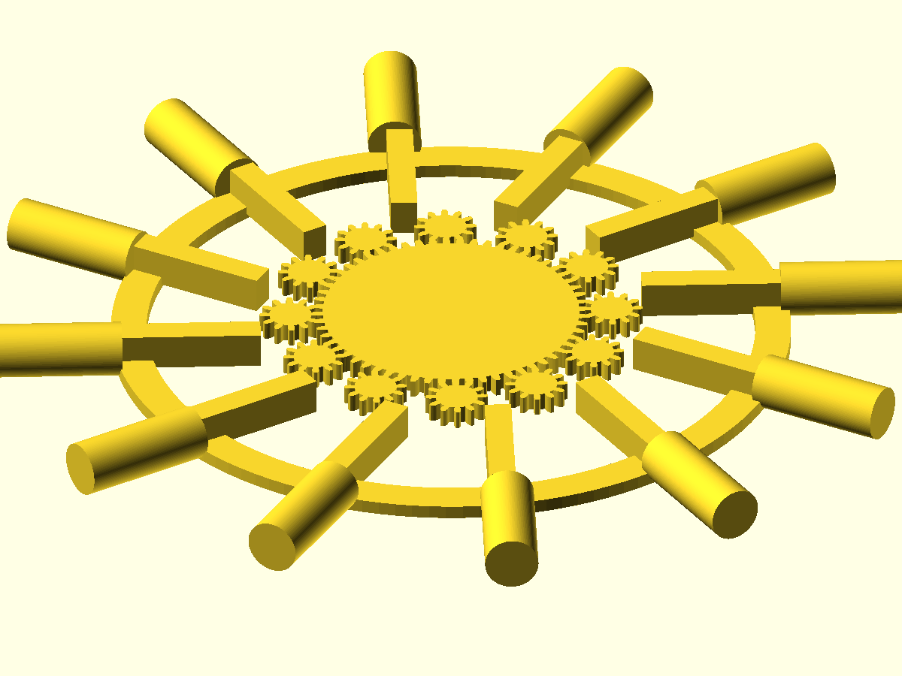

# Vault Door Mechanism Study



> *A small Python toy for the geometry of rotary vault-door pin mechanisms.
> Symmetry, gearing, packaging, and what 12 pins share that
> 13 pins can't.*

## I made this because I got curious

Watching Adam Savage's mini vault-door build, I kept staring at one
detail I didn't understand at first: each pin had a section of straight
gear teeth cut into it, and the back of that section — the spine,
opposite the teeth — was machined surprisingly thin. More material
removed than weight savings would justify. When the parts went together
inside the door it clicked. **The pin count was forcing the geometry.**

A single central pinion has to drive all N racks at once, the racks
share the perimeter of that one pinion, and each rack's spine gets
machined down to whatever slice it gets. Bigger N → thinner slice.
Adam wasn't choosing the shape; the pin count was choosing it for him.

That observation kept me up an evening. This repo is what came out — a
Python parametric study of how pin count, symmetry, gearing, and
packaging interact on a circular vault door. Every diagram below is
generated from one parameter file
([`vault.py`](../../src/vault/vault.py)); change a number, every page
re-derives.

## Play with it

**[→ Open the live pin-count explorer](https://jmcpheron.github.io/pycon2026/vault/pin-explorer.html)**

Drag the slider from 3 to 30 pins. The layout snaps. The readout panel
shows the angle step (`360/N`), the divisors of N, whether the count
has exact opposing pairs, and how thin the rack body has to be at that
pin count given the canonical 12 mm pinion.

> 12 reads clean.  13 works but doesn't share.  24 pinches the racks to slivers.

*(Clicking that link from GitHub.com opens the page source. Open it
through GitHub Pages for the live version — the URL above lands you
there directly.)*

## Five short sections

1. [**Symmetry**](symmetry.md) — why 12 and 24 read as obvious and 13 doesn't.
2. [**The 13-pin problem**](thirteen-pin-problem.md) — it works mechanically; what it gives up are the *shortcuts* (shared racks, mirrored fixtures, sub-symmetric actuation). Honest framing of where prime hurts.
3. [**Pin counts**](pin-counts.md) — small-multiples comparison plus the rack-thinning note from watching Adam's video, with the inequality `t ≤ 2π·r_pinion/N − clearance` and a per-N budget table.
4. [**Motion and travel**](motion-and-travel.md) — what a 10° cam rotation actually gets you. `arc = r·θ`, the cam-radius table, and the careful distinction between *arc travel* and *radial pin travel*.
5. [**Onshape workflow**](onshape-workflow.md) — how the Python parameters in [`vault.py`](../../src/vault/vault.py) map to a parametric CAD model.

## For the Tested community

If you got here via the Tested Maker Share: hi. Adam's mini vault-door
build sparked this study; it is a love-letter to the geometry, not a
clone of his mechanism. Fork it, remix it, riff on it — change the pin
count in [`vault.py`](../../src/vault/vault.py), run `uv run vault build`,
and every page above re-derives with your numbers. The interactive
explorer takes the same input live in your browser. Send me what you
find.

## Default door parameters

* Door diameter: **160 mm**, thickness **8 mm**
* Pin count: **12** on a pitch circle of radius **70 mm**
* Pin travel: **8 mm** radial
* Central cam rotation: **10°** (sweeps **12.22 mm** of arc at the pin radius)
* Central pinion radius: **12 mm** (bounds rack-body thickness to **5.98 mm** at N = 12)

Change any of these in [`vault.py`](../../src/vault/vault.py) and the
explainer pages, hero animation, and budget tables all re-derive on the
next `uv run vault build`.

## Print one · remix it

The five canonical mechanism parts ship as standalone STLs alongside
the hero GIF, ready to drop into Bambu Studio, Onshape, or any other
3D tool:

* [`assets/parts/ring-gear.stl`](assets/parts/ring-gear.stl) — central 60-tooth ring gear (module 1). Print **1×**.
* [`assets/parts/spur-gear.stl`](assets/parts/spur-gear.stl) — one 12-tooth satellite spur gear. Print **12×**.
* [`assets/parts/rack.stl`](assets/parts/rack.stl) — one rack, already pre-milled on its spine to the per-pin tangential budget (5.98 mm). Print **12×**.
* [`assets/parts/pin.stl`](assets/parts/pin.stl) — one 12 mm × 30 mm locking pin. Print **12×**.
* [`assets/parts/door-rim.stl`](assets/parts/door-rim.stl) — the 152.4 mm annulus the pins ride through. Print **1×**.

To regenerate them locally (no OpenSCAD required for parts-only
export — build123d is enough):

```
uv run vault export-parts --out-dir /tmp/vault-parts
```

## How it gets built

```
src/vault/<topic>.py     ─►  uv run vault build <topic>      ─►  docs/vault/<topic>.md (+ assets/*.svg)
src/vault/mechanism.py   ─►  uv run vault build-mechanism    ─►  docs/vault/assets/vault-hero.gif
                                                                 + docs/vault/assets/parts/*.stl
src/vault/mechanism.py   ─►  uv run vault export-parts       ─►  docs/vault/assets/parts/*.stl  (parts only, no GIF)
```

The lightweight pages are regenerated by
[`.github/workflows/build-vault.yml`](../../.github/workflows/build-vault.yml)
on every push that touches `src/vault/` and auto-committed back to
`main`. The detailed mechanism GIF — which needs build123d,
`bd_warehouse`, OpenSCAD, and xvfb — runs on its own slower workflow
[`.github/workflows/build-vault-mechanism.yml`](../../.github/workflows/build-vault-mechanism.yml).
Both auto-commit alongside the parallel workflows for the gear card and
the engineering explainers.

The interactive [`pin-explorer.html`](pin-explorer.html) is *not*
regenerated — it's hand-written, self-contained, deployed by
[`.github/workflows/pages.yml`](../../.github/workflows/pages.yml).

## Disclaimer · licenses

This is a fan-made educational mechanism study inspired by public maker
videos and general vault-door mechanisms. It is **not** an official
Tested project, does not reproduce any private plans, and is not
affiliated with Adam Savage's Tested.com.

Code: MIT.
Diagrams + 3D files under this directory: CC BY-SA 4.0.
See [`LICENSE`](../../LICENSE) and [`LICENSE-3D-FILES`](../../LICENSE-3D-FILES).

## Credits — the libraries that draw the pictures

The static SVG diagrams (symmetry, pin-counts, motion, the 13-pin
comparison) are drawn with
[`drawsvg`](https://github.com/cduck/drawsvg) (MIT).
The mechanism GIF above is built from
[`build123d`](https://github.com/gumyr/build123d) and
[`bd_warehouse`](https://github.com/gumyr/bd_warehouse) parts (both
Apache-2.0) — `bd_warehouse.gear.SpurGear` is what gives us the
involute-tooth ring and spur gears — rendered frame-by-frame through
[OpenSCAD](https://openscad.org/) (GPL-2.0-or-later) and stitched into
a GIF with [Pillow](https://github.com/python-pillow/Pillow) (MIT-CMU).
The full list of third-party tools the repo leans on lives in
[`ACKNOWLEDGMENTS.md`](../../ACKNOWLEDGMENTS.md).

---

*Generated by `src/vault/index.py`. Source-of-truth parameters live in
[`src/vault/vault.py`](../../src/vault/vault.py).*
