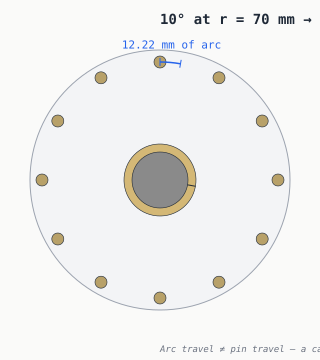

# Motion and travel — what 10° gets you

A 10° rotation doesn't sound like much. At a large
radius, the edge of the mechanism still moves several millimetres — and a
cam slot or linkage can convert some of that motion into useful radial
*pin* travel.



## arc = r · θ

For an angle θ in radians, a point at radius r sweeps an arc of length
r·θ.

```
arc_length = radius × angle_in_radians
10°  =  0.174533 rad
```

| Radius     | Arc travel at 10° |
|-----------:|--------------------------------------:|
|   20.0 mm |   3.49 mm |
|   40.0 mm |   6.98 mm |
|   60.0 mm |  10.47 mm |
|   70.0 mm |  12.22 mm |
|  100.0 mm |  17.45 mm |

At the default pin radius of 70 mm, a
10° cam rotation sweeps
**12.22 mm** along the pin pitch circle.

## Important caveat — arc travel ≠ pin travel

The pin moves *radially* (in toward the hub or out toward the door edge),
not tangentially. Arc travel is what the cam slot has to cover; the
*pin* travel is whatever component of that arc the slot geometry
projects radially.

The actual radial pin travel depends on the actuator:

* **Cam slot in a rotating plate** — slot angle and slot length set the
  radial component.
* **Rack and pinion** — pin moves in a straight line driven by a
  perpendicular gear; ratio is fixed by gear and rack geometry.
* **Crank linkage** — non-linear; faster near 0°, slower near full
  travel.
* **Lever arm** — multiplies or divides cam motion by the lever ratio.
* **Follower geometry, friction, clearance** — every real mechanism
  gives back some travel to slop and to part finish.

For the default vault parameters (pin travel = 8 mm),
the actuator must convert ~12.2 mm of arc into
8 mm of radial throw. A 8/12.2
≈ 0.65 ratio is well inside what a
short cam slot or a 1:1 lever can handle.

---

*Generated by `src/vault/motion.py`. Cam rotation and pin radius come
from `src/vault/vault.py`.*
