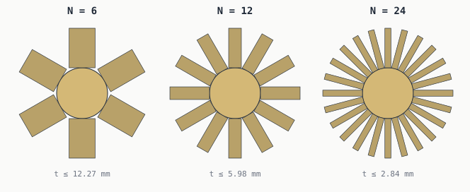

# Pin counts — comparing 6, 8, 12, 13, 24

A circular vault door doesn't care what pin count you pick — they all add
up to 360° eventually. The mechanism around the door cares
a lot.


## The comparison table

| Pin Count | Angle Step | Opposing Pairs? | Clean Quadrants? | Notes |
|----------:|----------:|:---------------:|:----------------:|-------|
| 6  | 60.000° | yes | no  | hex-like; only 2- and 3-fold symmetry |
| 8  | 45.000° | yes | yes | clean diagonal symmetry |
| 12 | 30.000° | yes | yes | clock-like, very friendly |
| 13 | 27.692° | **no** | **no** | possible, but awkward |
| 24 | 15.000° | yes | yes | very flexible and divisible |

## Divisors at a glance


Composite pin counts give the mechanism designer many ways to divide,
mirror, and repeat a design. Prime pin counts (red row) give two: 1, and
the count itself.

That's not a bug in primes — it's the *definition* of prime. It just means
a 13-pin mechanism either uses 13
identical individually-routed actuators, or one custom shape. There's no
elegant middle ground.

## Picking a pin count

If your design doesn't have a strong reason to pick a prime, pick a
composite. 12 is the obvious starting point — it inherits all
the readability of a clock face.

If you want twice the resolution but the same friendliness, jump to
24.

If you want a conversation piece, pick 13 on purpose and
[lean into the constraint](thirteen-pin-problem.md).

## A note from watching Adam Savage's mini vault build

> *Watching Adam Savage machine the pins for his mini vault door build, I
> kept staring at one detail and not getting it: each pin had a section
> of straight gear teeth cut into it, and the **back** of that section —
> the spine, opposite the teeth — was machined surprisingly thin. Way
> more material removed than you'd expect for weight savings. Then I saw
> the parts assembled inside the door and it clicked. He didn't choose
> that shape; the pin count chose it for him.*

The build style is a **rack-and-pinion central drive**: each pin carries
a section of straight gear teeth (a *rack*) along one face, and a single
central pinion gear at the hub meshes with **all N racks at once**. Turn
the handle, the pinion rotates, every pin translates radially in unison.



For all N racks to engage the same pinion, they have to share the
perimeter of the pinion's pitch circle. That perimeter is `2π · r`, and
the N rack bodies — each with some tangential thickness `t` — must fit
side-by-side around it without colliding:

```
N · (t + clearance)  ≤  2π · r_pinion
```

Re-arranged, the upper bound on each rack body's tangential thickness is

```
t  ≤  (2π · r_pinion / N)  −  clearance
```

So the central pinion's circumference is a **budget** the N racks split
between them. Halve the pinion radius, halve the budget. Double the pin
count, halve the budget. There is nowhere else for the material to go,
so you machine the spine of every rack thinner until it fits its slice.
The teeth themselves have to stay full-profile to mesh — *the spine is
the only place material can come from.*

For this study's parameters — a central pinion of radius **12 mm**
driving **12** racks with 0.3 mm clearance —
each rack body gets at most **5.98 mm**
of tangential thickness:

| Pin count N | Rack body budget `t ≤ 2π·12/N − 0.3` |
|------------:|-------------------------------------------------------------------:|
| 6  | 12.27 mm |
| 8  | 9.12 mm |
| 12 | 5.98 mm |
| 13 | 5.50 mm |
| 24 | 2.84 mm |

That is what **"design tax"** looks like in metal. Pin count doesn't just
choose where each pin lives on the door — it dictates how much *meat*
every rack body is allowed to keep.

(Adam Savage's video is a great public reference for the build style;
the specific mechanism geometry is not reproduced here. This is a
fan-made educational study, not affiliated with Tested.)

---

*Generated by `src/vault/pin_counts.py`. Pin counts and the central
pinion radius come from `src/vault/vault.py`.*
