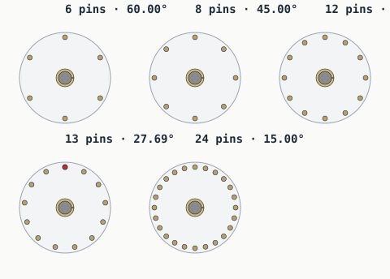
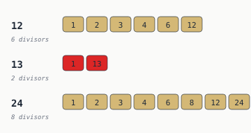

# Pin counts — comparing 6, 8, 12, 13, 24

A circular vault door doesn't care what pin count you pick — they all add
up to 360° eventually. The mechanism around the door cares
a lot.

## The comparison table

| Pin Count | Angle Step | Opposing Pairs? | Clean Quadrants? | Notes |
|----------:|----------:|:---------------:|:----------------:|-------|
| 6  | 60.000° | yes | no  | hex-like; only 2- and 3-fold symmetry |
| 8  | 45.000° | yes | yes | clean diagonal symmetry |
| 12 | 30.000° | yes | yes | clock-like, very friendly |
| 13 | 27.692° | **no** | **no** | possible, but awkward |
| 24 | 15.000° | yes | yes | very flexible and divisible |

## Divisors at a glance

Composite pin counts give the mechanism designer many ways to divide,
mirror, and repeat a design. Prime pin counts (red row) give two: 1, and
the count itself.

That's not a bug in primes — it's the *definition* of prime. It just means
a 13-pin mechanism either uses 13
identical individually-routed actuators, or one custom shape. There's no
elegant middle ground.

## Picking a pin count

If your design doesn't have a strong reason to pick a prime, pick a
composite. 12 is the obvious starting point — it inherits all
the readability of a clock face.

If you want twice the resolution but the same friendliness, jump to
24.

If you want a conversation piece, pick 13 on purpose and
[lean into the constraint](thirteen-pin-problem.md).

---

*Generated by `src/vault/pin_counts.py`. Pin counts come from
`src/vault/vault.py`.*
