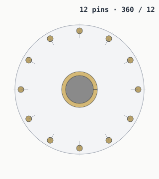
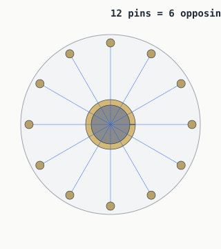
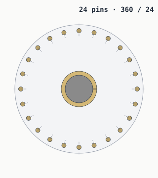

# Symmetry — why circles love friendly numbers

> A vault door has to coordinate many locking pins from one rotation. The
> pin count you pick changes how easy that coordination is to design,
> mirror, repeat, and balance.

## 360 ÷ N — the angle-step table

| Pins (N) | 360 / N        | Clean halves? | Clean quarters? | Clock analogy |
|---------:|---------------:|:--------------|:----------------|:--------------|
| 6        | 60.000°    | yes           | no              | every 2 hours |
| 8        | 45.000°    | yes           | yes             | half-hours, sort of |
| 12       | 30.000°   | yes           | yes             | one per hour |
| 13       | 27.692°    | no            | no              | drifts off |
| 24       | 15.000°    | yes           | yes             | hours + half-hours |

For N = 12, every pin sits exactly 30° from its
neighbours. Think of it as a clock face — the layout snaps to the same
positions a wall clock uses, which is why a 12-pin layout reads
as obvious without any extra annotation.

## Opposing pairs

A pin at angle θ and another at angle θ + 180° are an *opposing pair*. A
mechanism that drives both ends of the pair from one shared link only
needs N/2 unique parts, mirrored. That only works if N is even.

For N = 12 pins, that's 6 pairs. For N = 24
pins, 12 pairs. For N = 13, no exact pairs at all — one
pin always lands without a partner across the diameter. (See [the 13-pin
problem](thirteen-pin-problem.md).)

## Why 24 is *especially* flexible

24 divides cleanly by 1, 2, 3, 4, 6, 8, 12, and 24.
That's eight ways to split the layout into mirrored or repeated subassemblies.
The mechanism designer can group pins into halves, quarters, sixths,
eighths — whatever the actuator wants — and still get even spacing.

A 24-pin door is not "twice as locked" as a
12-pin door; it just gives you finer rotational resolution and
more ways to share parts.

---

*Generated by `src/vault/symmetry.py`. Edit `src/vault/vault.py` and the
numbers above re-derive on the next build.*
