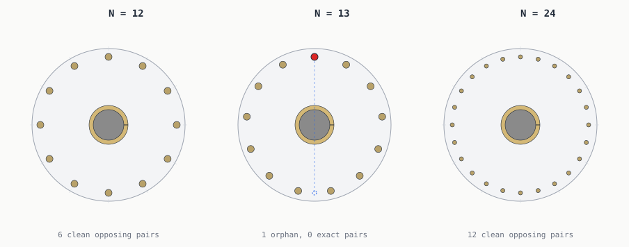
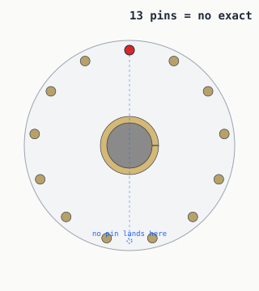
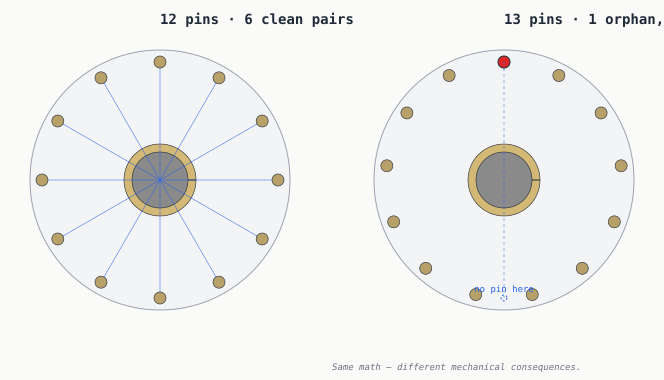

# The 13-pin vault problem



> *Three doors, one cycle. Every pin in every panel locks and unlocks.
> The middle panel's darker-brass pin is the one with **no mirror twin**
> across the diameter — the dashed marker shows where its partner would
> have to sit. The mechanism still works; it just can't share parts the
> way 12 and 24 can.*

A 13-pin vault door **works**. In CAD, placing
13 equally spaced pins around a circle is one circular
pattern. Mechanically, a central pinion driving 13 racks
locks and unlocks the door exactly the way 12 or
24 racks would. The geometry doesn't refuse the
prime.

What 13 refuses is a **set of design shortcuts** —
optimizations that composite pin counts get for free and prime pin
counts have to pay full price for. That's the real story, and it's
worth being precise about it.

## Tricks the geometry allows

For any N (prime or composite), all of these work:

* a single central pinion driving N racks — Adam Savage's mini-vault
  pattern, see [pin-counts.md](pin-counts.md)
* a cam plate with N follower slots
* a worm-gear ring driving each pin off its own pinion
* N independent levers, each with its own cam profile

For composite N (like 12 or 24), these
*also* work:

* **one shared rack driving two opposite pins** — needs an exact pair
  across the diameter, so N must be even
* **a mirror-image sub-assembly used N/2 times** — needs bilateral
  symmetry through pin centres, so N must be even
* **cyclic sub-symmetry actuation** — lock half, then the other half;
  lock thirds; lock quarters. Needs a non-trivial subgroup of C_N,
  which exists exactly when N has divisors other than 1 and N

For 13, none of those three are available. 13
is prime — its only divisors are 1, 13.

## The math, fully

13 pins can be spaced exactly evenly:

```
360 / 13 = 27.692°
```

Place pin 0 at the top, walk 27.692° around
the circle for each subsequent pin, and the 13th pin
lands exactly where you started. The radial forces from all
13 pins acting symmetrically on the hub **sum to zero**
— same as any regular N-gon arrangement; primality doesn't break force
balance.

What primality breaks is the **opposing-pair relation**. A pin at angle
A on a 13-pin door has no other pin at angle A + 180°.
The closest two pins land off by half an angle step
(13.846°).



The dashed marker is where pin 0's mirror twin *would* have to sit on a
12-pin door. On 13 pins it falls between two
real pins, off by half an angle step. The pin itself isn't broken — it
just has nothing to be paired with.



## Where it actually hurts

Whether you care depends on the design you wanted to build:

| Design trick                                    | Works for 12? | Works for 13? |
|-------------------------------------------------|---:|---:|
| Central pinion + N independent racks            | ✓ | **✓** |
| Cam plate with N follower slots                 | ✓ | **✓** |
| Independent levers, one cam profile per pin     | ✓ | **✓** |
| One shared rack driving two opposite pins       | ✓ | ✗ |
| Mirror sub-assembly fixtured & cast N/2 times   | ✓ | ✗ |
| Multi-stage lock — wave of N/2, then N/2        | ✓ | ✗ |
| Multi-stage lock — wave of N/3, three times     | ✓ | ✗ |

The first three rows are the "no-tricks" path. They work for any N.
That's the path that lets a 13-pin door function.

The last four are the optimizations a composite count buys you — shared
parts, mirrored fixtures, sub-symmetric actuation. 13
locks you out of all of them.

## Divisors at a glance

```
divisors(12)  = 1, 2, 3, 4, 6, 12
divisors(13)  = 1, 13
divisors(24)  = 1, 2, 3, 4, 6, 8, 12, 24
```

Composite numbers give mechanical designers many ways to divide, mirror,
and repeat a design. Prime numbers give two: 1, and the number itself.

That's not a bug in primes — it's the *definition* of prime. It just
means a 13-pin design either uses 13
identical, individually-fitted actuators, or one custom geometry.
There's no elegant middle ground.

## Picking 13 on purpose

If you want the elegance, pick 12 or 24.
You'll have more design options.

If you want a conversation piece — a door that genuinely doesn't admit
mirror simplification, where every part is unique by necessity — pick
13 and lean into it.

What you don't have to choose between is "works" and "doesn't work."
Both work. The honest framing is:

> Prime pin counts aren't mechanically broken. They just don't share.

---

*Generated by `src/vault/thirteen_pin.py`. Pin counts come from
[`src/vault/vault.py`](../../src/vault/vault.py).*
