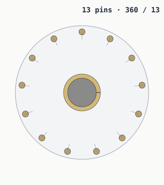

# The 13-pin vault problem


> *Three doors, one cycle. Watch the middle panel: pin 0 is red because
> it has no partner across the diameter. The dashed marker shows where
> its missing partner would have to sit.*

A 13-pin vault door is not impossible. In CAD, placing
13 equally spaced pins around a circle is one circular
pattern away.

The problem is that mechanisms aren't just math. Physical designs like
*symmetry, repeated parts, mirrored linkages,* and *predictable
clearances*. 13 is prime, so it refuses many of the
shortcuts that make a 12-pin or 24-pin
mechanism elegant.

> Prime numbers aren't impossible in CAD. They're just rude to symmetry.



## The math works

13 pins can be spaced exactly evenly:

```
360 / 13 = 27.692307692307693°
```

Place pin 0 at the top, walk 27.692° around
the circle for each subsequent pin, and the 13th pin lands
exactly where you started. Geometrically: clean.

## The symmetry doesn't

There are no exact opposite pairs. A pin at angle A doesn't have another
pin exactly 180° away.


That dashed marker is where pin 0's "partner" *would* sit on a
12-pin door. On 13 pins it falls between two
real pins, off by half an angle step
(13.846°).


## Why that matters

If a design uses any of these shortcuts:

* one shared rack driving two pins on opposite sides
* a single mirrored linkage subassembly used N/2 times
* a cam plate with N/2-fold rotational symmetry
* matched pairs of pins that share an actuator
* balanced forces around the diameter

…then a 13-pin count forces a custom solution for the
unmatched pin (or every pin).

## Divisors, in plain sight

```
divisors(12) = 1, 2, 3, 4, 6, 12
divisors(13) = 1, 13
divisors(24) = 1, 2, 3, 4, 6, 8, 12, 24
```

Composite numbers give mechanical designers more ways to divide, mirror,
and repeat a design. Prime numbers give fewer shortcuts.

## Not impossible — just less reusable

A 13-pin design *could* work with:

* a cam plate with 13 independent follower slots
* 13 independent levers driven by individual cam profiles
* a worm-gear ring driving each pin off its own pinion

What it gives up is the elegant repetition of 12 or
24: shared parts, mirrored subassemblies, predictable
balance.

So: pick 12 or 24 unless you want to make
13 interesting on purpose.

---

*Generated by `src/vault/thirteen_pin.py`. Pin counts come from
`src/vault/vault.py`.*
